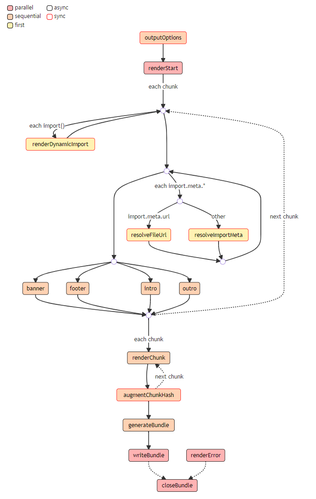

# Rollup 插件开发

- 插件概述
- 一个简单的例子
- 官方约定
- Properties
- Build Hooks
  - buildEnd
  - buildStart
  - closeWatcher
  - load
  - moduleParsed
  - options
  - resolveDynamicImport
  - resolveId
  - shouldTransformCachedModule
  - transform
  - watchChange
- Output Generation Hooks
  - augmentChunkHash
  - banner
  - closeBundle
  - footer
  - generateBundle
  - intro
  - outputOptions
  - outro
  - renderChunk
  - renderDynamicImport
  - renderError
  - renderStart
  - resolveFileUrl
  - resolveImportMeta
  - writeBundle
- Plugin Context
  - this.addWatchFile
  - this.emitFile
  - this.error
  - this.getCombinedSourcemap
  - this.getFileName
  - this.getModuleIds
  - this.getModuleInfo
  - this.getWatchFiles
  - this.load
  - this.meta
  - this.parse
  - this.resolve
  - this.setAssetSource
  - this.warn

# rollup 插件概述

Rollup 插件是由 [properties](https://rollupjs.org/guide/en/#properties), [build hooks](https://rollupjs.org/guide/en/#build-hooks), 以及 [output generation hooks](https://rollupjs.org/guide/en/#output-generation-hooks) 三部分组成。插件应该遵循官方约定，它应该作为一个包发布，它导出一个可以使用插件特定选项调用的函数并返回一个对象。

插件允许您自定义 Rollup 的行为，例如，在打包之前转译代码，或在 <font color=#aa1e1e>node_modules</font> 文件夹中查找第三方模块。有关如何使用它们的示例，请参阅[使用插件](https://rollupjs.org/guide/en/#using-plugins)。

更多插件的使用请参考[插件列表](https://github.com/rollup/awesome)。

# 一个简单的例子

以下插件将在不访问文件系统的情况下拦截 <font color=#aa1e1e>virtual-module（虚拟模块）</font> 的任何导入。例如，如果你需要在浏览器中使用 Rollup。它甚至可用于替换入口点，如示例中所示。

```js
// rollup-plugin-my-example.js
export default function myExample () {
  return {
    name: 'my-example', // this name will show up in warnings and errors
    resolveId ( source ) {
      if (source === 'virtual-module') {
        return source; // this signals that rollup should not ask other plugins or check the file system to find this id
      }
      return null; // other ids should be handled as usually
    },
    load ( id ) {
      if (id === 'virtual-module') {
        return 'export default "This is virtual!"'; // the source code for "virtual-module"
      }
      return null; // other ids should be handled as usually
    }
  };
}

// rollup.config.js
import myExample from './rollup-plugin-my-example.js';
export default ({
  input: 'virtual-module', // resolved by our plugin
  plugins: [myExample()],
  output: [{
    file: 'bundle.js',
    format: 'es'
  }]
});
```

# 官方对于插件的一些约定

1. 插件名字最好带上 “rollup-plugin-” 前缀。
2. 在 package.json 文件中应该包含 “rollup-plugin” 关键字。
3. 你的插件应该进行测试。我们建议使用 [mocha](https://github.com/mochajs/mocha) 或者 [ava](https://github.com/avajs/ava) 这类支持 promises 的库。
4. 尽可能使用异步方法。
5. 使用英文编写插件文档
6. 如果合适的话，确保你的插件输出正确的 sourcemap
7. 如果你的插件使用 'virtual modules'（比如：helper functions），请在模块名加上 “\0” 前缀。这样做可以阻止其他插件执行它。

# hooks 介绍

rollup Hooks 分为两类：<font color=#aa1e1e>Build Hooks</font> 和 <font color=#aa1e1e>Output Generation Hooks</font>

为了与构建过程交互，您的插件对象应该包含 "hooks"，后面称其为 "钩子"。钩子是在构建的各个阶段调用的函数。钩子可以影响构建的运行方式、提供有关构建的信息或在完成后修改构建。有如下不同种类的钩子：

- <font color=#aa1e1e>async</font>：这类钩子可以返回解析为相同类型值的 Promise; 否则，钩子将标记为 sync。
- <font color=#aa1e1e>first</font>：如果多个插件实现了这个钩子，钩子将按顺序运行，直到钩子返回 null 或 undefined。
- <font color=#aa1e1e>sequential</font>：如果多个插件实现了此钩子，它们都将按照指定的插件顺序运行。如果一个钩子是异步的，这种类型的后续钩子将一直等待，直到当前钩子被解析。
- <font color=#aa1e1e>parallel</font>：如果多个插件实现了这个钩子，它们都将按照指定的插件顺序运行。如果一个钩子是异步的，则此类后续钩子将并行运行，而不是等待当前钩子。

钩子既可以是对象，也可以是函数。**如果是对象情况下，必须将 handler 写成函数的形式。**并且你还可以提供两个属性 <font color=#aa1e1e>order</font> 和 <font color=#aa1e1e>sequential</font>：

- order: "pre" | "post" | null
  - order："pre" 选项值表示请先运行此插件。
  - order："post" 选项值表示请最后一个运行此插件。
  - order：null 表示在用户指定的位置运行。

```js
export default function resolveFirst() {
  return {
    name: 'resolve-first',
    resolveId: {
      order: 'pre',
      handler(source) {
        if (source === 'external') {
          return { id: source, external: true };
        }
        return null;
      }
    }
  };
}
```

如果多个插件使用 “pre” 或 “post”，则 Rollup 将按用户指定的顺序运行它们。此选项可用于所有插件钩子。对于并行钩子，它会更改钩子的同步部分的运行顺序。

- sequential: boolean

不要将此钩子与其他插件的相同钩子并行运行。只能用于 parallel 钩子。使用此选项将使 Rollup 等待所有先前插件的结果，然后执行插件钩子，然后再次并行运行剩余的插件。例如，当你有插件 A，B，C，D，E 都实现相同的 parallel 钩子并且中间插件 C 的 sequential 设置为 true 时，那么 Rollup 将首先并行运行 A + B，然后是 C 本身，最后是 D + E 并行运行。

当您需要在相互依赖的不同 [writeBundle](https://rollupjs.org/guide/en/#writebundle) 钩子中运行多个命令行工具时，您可以将此选项与 order 选项结合使用来达到指定的执行顺序。

```js
import { resolve } from 'node:path';
import { readdir } from 'node:fs/promises';

export default function getFilesOnDisk() {
  return {
    name: 'getFilesOnDisk',
    writeBundle: {
      sequential: true,
      order: 'post',
      async handler({ dir }) {
        const topLevelFiles = await readdir(resolve(dir));
        console.log(topLevelFiles);
      }
    }
  };
}
```

## Build Hooks

<font color=#aa1e1e>Build Hooks</font>在构建阶段运行，该阶段由 <font color=#aa1e1e>rollup.rollup(inputOptions)</font> 触发。它们主要关注在 Rollup 处理输入文件之前定位、提供和转换输入文件。构建阶段的第一个钩子是 <font color=#aa1e1e>options</font> ，最后一个钩子总是 <font color=#aa1e1e>buildEnd</font>。如果存在构建错误，<font color=#aa1e1e>closeBundle</font> 将被调用。


此外，在观察模式下，可以随时触发 [watchChange](https://rollupjs.org/guide/en/#watchchange) 钩子，以通知在当前运行生成其输出后将触发新的钩子函数。此外，当观察程序关闭时，将触发 [closeWatcher](https://rollupjs.org/guide/en/#closewatcher) 钩子。

### options

```ts
Type: (options: InputOptions) => InputOptions | null
Kind: async, sequential
Previous Hook: This is the first hook of the build phase.
Next Hook: buildStart
```

替换或操作传递给 rollup.rollup 的选项对象。返回 null 不会替换任何内容。如果您只需要阅读选项，建议使用 <font color=#aa1e1e>buildStart</font> 钩子，因为在考虑了所有选项钩子的转换后，该钩子可以访问选项。

这是唯一无法 <font color=#aa1e1e>Plugin-Context</font> 函数的钩子，因为它是在 Rollup 配置完成之前运行的。

### buildStart

```ts
Type: (options: InputOptions) => void
Kind: async, parallel
Previous Hook: options
Next Hook: resolveId to resolve each entry point in parallel.
```

被 rollup.rollup 方法调用。当您需要访问传递给 rollup.rollup 的选项时，这是比较推荐使用的钩子，因为它包含了未设置的默认值。

### resolveId

```ts
Type: (source: string, importer: string | undefined, options: {isEntry: boolean, assertions: {[key: string]: string}, custom?: {[plugin: string]: any}}) => string | false | null | {id: string, external?: boolean | "relative" | "absolute", assertions?: {[key: string]: string} | null, meta?: {[plugin: string]: any} | null, moduleSideEffects?: boolean | "no-treeshake" | null, syntheticNamedExports?: boolean | string | null}
Kind: async, first
Previous Hook: buildStart if we are resolving an entry point, moduleParsed if we are resolving an import, or as fallback for resolveDynamicImport. Additionally, this hook can be triggered during the build phase from plugin hooks by calling this.emitFile to emit an entry point or at any time by calling this.resolve to manually resolve an id.
Next Hook: load if the resolved id has not yet been loaded, otherwise buildEnd.
```

定义入口的自定义解析函数。自定义解析函数可用于例如查找第三方依赖项。请看如下例子：

```js
import { foo } from '../bar.js';
```

这里导入了 “../bar.js”

resolveId 钩子接收三个参数分别是 source（源代码），importer（被谁导入），options（选项对象），并且可以返回 string | false | null | object 中的任一值。

options.isEntry 选项将告诉你我们是否正在解析用户定义的入口模块，或者是否为 this.resolve 上下文函数提供了 isEntry 参数。

以下示例演示了自定义解析函数。插件演示了如何自定义“import”的解析。

```js
// We prefix the polyfill id with \0 to tell other plugins not to try to load or
// transform it
const POLYFILL_ID = '\0polyfill';
const PROXY_SUFFIX = '?inject-polyfill-proxy';

function injectPolyfillPlugin() {
  return {
    name: 'inject-polyfill',
    async resolveId(source, importer, options) {
      if (source === POLYFILL_ID) {
        // It is important that side effects are always respected for polyfills,
        // otherwise using "treeshake.moduleSideEffects: false" may prevent the
        // polyfill from being included.
        return { id: POLYFILL_ID, moduleSideEffects: true };
      }
      if (options.isEntry) {
        // Determine what the actual entry would have been. We need "skipSelf"
        // to avoid an infinite loop.
        const resolution = await this.resolve(source, importer, { skipSelf: true, ...options });
        // If it cannot be resolved or is external, just return it so that
        // Rollup can display an error
        if (!resolution || resolution.external) return resolution;
        // In the load hook of the proxy, we need to know if the entry has a
        // default export. There, however, we no longer have the full
        // "resolution" object that may contain meta-data from other plugins
        // that is only added on first load. Therefore we trigger loading here.
        const moduleInfo = await this.load(resolution);
        // We need to make sure side effects in the original entry point
        // are respected even for treeshake.moduleSideEffects: false.
        // "moduleSideEffects" is a writable property on ModuleInfo.
        moduleInfo.moduleSideEffects = true;
        // It is important that the new entry does not start with \0 and
        // has the same directory as the original one to not mess up
        // relative external import generation. Also keeping the name and
        // just adding a "?query" to the end ensures that preserveModules
        // will generate the original entry name for this entry.
        return `${resolution.id}${PROXY_SUFFIX}`;
      }
      return null;
    },
    load(id) {
      if (id === POLYFILL_ID) {
        // Replace with actual polyfill
        return "console.log('polyfill');";
      }
      if (id.endsWith(PROXY_SUFFIX)) {
        const entryId = id.slice(0, -PROXY_SUFFIX.length);
        // We know ModuleInfo.hasDefaultExport is reliable because we awaited
        // this.load in resolveId
        const { hasDefaultExport } = this.getModuleInfo(entryId);
        let code =
          `import ${JSON.stringify(POLYFILL_ID)};` + `export * from ${JSON.stringify(entryId)};`;
        // Namespace reexports do not reexport default, so we need special
        // handling here
        if (hasDefaultExport) {
          code += `export { default } from ${JSON.stringify(entryId)};`;
        }
        return code;
      }
      return null;
    }
  };
}
```

- resolveId 钩子函数如果返回 null 会推迟执行其他的 resolveId 钩子，并最终推迟默认解析行为。如果返回 false，表示 source 应被视为外部模块，而不是包含在捆绑包中。最终的行为和设置 external option 是一样的。

- resolveId 钩子函数如果返回一个 object，则可以将导入解析为不同的 id，同时将其从捆绑包中排除。这允许您将依赖项替换为外部依赖项，而无需用户通过手动将它们标记为"external"：

```js
function externalizeDependencyPlugin() {
  return {
    name: 'externalize-dependency',
    resolveId(source) {
      if (source === 'my-dependency') {
        return { id: 'my-dependency-develop', external: true };
      }
      return null;
    }
  };
}
```

如果 external 设置为 true，则绝对路径 id 将根据用户对 [makeAbsoluteExternalsRelative](https://rollupjs.org/guide/en/#makeabsoluteexternalsrelative) 选项的选择转换为相对路径 id。可以通过设置 external："relative" 以始终将绝对路径 id 转换为相对 路径 id 或者设置 external: "absolute" 以将其保留为绝对路径 id 来覆盖此选择。resolveId 钩子函数返回对象时，模块 id 的相对路径，即以 ./ 或 ../ 不会在内部转换为绝对路径 id 并在输出中转换回相对路径 id，而是原封不动地包含在输出中。如果您希望对相对路径 id 进行重新规范化和重复数据删除，请将绝对路径作为 id 返回，然后设置 external: "relative"。

如果在解析模块 ID 的第一个钩子中为 moduleSideEffects 返回 false，并且没有其他模块从该模块导入任何内容，则即使该模块会产生副作用，也不会包含此模块。如果返回 moduleSideEffects: true，则 Rollup 将使用其默认算法在模块中包含具有副作用（如修改全局变量或导出变量）的所有语句。如果返回 moduleSideEffects: “no-treeshake”，则此模块的 “treeshaking” 功能将被关闭，即使它是空的，它也将包含在生成的一个块中。如果返回 moduleSideEffects: null 或省略该标志，则 moduleSideEffects 将由 treeshake.moduleSideEffects 选项确定或默认为 true。<font color=#aa1e1e>load</font>钩子和<font color=#aa1e1e>transform</font>钩子可以覆盖这个行为。

如果返回的对象中包含了断言为 external: true，这将决定在生成“es”格式的模块时如何呈现此模块的导入。例如 {id： “foo”， external： true， assertions： {type： “json”\}} 将导致此模块的 import "foo" 断言 {type： “json”}。如果不传递值，将使用断言输入参数的值。传递空的对象以删除任何断言。虽然断言不会影响最终的 bundle ，但它们仍需要在模块的所有导入中保持一致，否则会发出警告。<font color=#aa1e1e>load</font>钩子和<font color=#aa1e1e>transform</font>钩子可以覆盖这个行为。

有关合成命名导出选项，请参阅[syntheticNamedExports](https://rollupjs.org/guide/en/#synthetic-named-exports)。如果返回 null 或省略该标志，则 syntheticNamedExports 将默认为 false。<font color=#aa1e1e>load</font>钩子和<font color=#aa1e1e>transform</font>钩子可以覆盖这个行为。

有关如何使用 meta 选项，请参阅[custom module meta-data](https://rollupjs.org/guide/en/#custom-module-meta-data)。如果返回 null 或省略该选项，则 meta 将默认为空对象。<font color=#aa1e1e>load</font>钩子和<font color=#aa1e1e>transform</font>钩子可以覆盖这个行为。

> 请注意，虽然每次导入模块都会调用 resolveId 钩子，因此可以多次解析为相同的 id，但在加载模块之前，只能设置一次 external、assertions、meta、moduleSideEffects 或 syntheticNamedExports 的值。原因是在调用 resolveId 钩子之后，Rollup 将继续使用该模块的<font color=#aa1e1e>load</font>钩子和<font color=#aa1e1e>transform</font>钩子，这些钩子可能会覆盖这些值。

当通过 <font color=#aa1e1e>this.resolve</font> 从插件触发此钩子时，可以将自定义选项对象传递给此钩子。虽然此对象将原封不动地传递，但插件应遵循添加自定义属性的约定，该属性与对象中的键对应于选项所针对的插件的名称。有关详细信息，请参阅[custom resolver options](https://rollupjs.org/guide/en/#custom-resolver-options)。

在观察模式下或显式使用 cache 时，缓存模块的解析导入也会从缓存中获取，并且不会再次通过 resolveId 钩子确定。为了防止这种情况，你可以从该模块的 <font color=#aa1e1e>shouldTransformCachedModule</font> 钩子返回 true。这将从缓存中删除模块并导入 resolutions，并再次<font color=#aa1e1e>transform</font>钩子和 <font color=#aa1e1e>resolveId</font>钩子。

### load

```ts
Type: (id: string) => string | null | {code: string, map?: string | SourceMap, ast? : ESTree.Program, assertions?: {[key: string]: string} | null, meta?: {[plugin: string]: any} | null, moduleSideEffects?: boolean | "no-treeshake" | null, syntheticNamedExports?: boolean | string | null}
Kind: async, first
Previous Hook: resolveId or resolveDynamicImport where the loaded id was resolved. Additionally, this hook can be triggered at any time from plugin hooks by calling this.load to preload the module corresponding to an id.
Next Hook: transform to transform the loaded file if no cache was used, or there was no cached copy with the same code, otherwise shouldTransformCachedModule.
```

自定义加载函数。返回 null 会推迟其他的 load 函数（并最终从文件系统加载的默认行为）。为了防止额外的解析开销，例如，由于某种原因，这个钩子已经使用 this.parse 来生成 AST，这个钩子可以选择返回一个 { code， ast， map } 对象。ast 必须是具有每个节点的开始和结束属性的标准 ESTree AST。可以通过将 map 设置为 null 来保留现有 sourcemap。否则，您可能需要生成 sourcemap。请参阅有关[source code transformations](https://rollupjs.org/guide/en/)。

如果为 moduleSideEffects 返回 false，并且没有其他模块从此模块导入任何内容，则即使该模块会产生副作用，此模块也不会包含在 bundle 中。如果返回 true，则 Rollup 将使用其默认算法在模块中包含具有副作用（如修改全局变量或导出变量）的所有语句。如果返回“no-treeshake”，则此模块的 treeshaking 功能将被关闭，即使它是空的，它也将包含在生成的一个块中。如果返回 null 或省略该标志，则 moduleSideEffects 将由解析此模块的第一个 resolveId 钩子、treeshake.moduleSideEffects 选项决定，或者最终默认为 true。<font color=#aa1e1e>transform</font>钩子可以覆盖这一点。

assertions 选项包含导入此模块时使用的导入断言。目前，它们不会影响 bundled modules 的渲染，而是用于文档目的。如果返回 null 或省略该标志，则断言将由解析此模块的第一个 resolveId 钩子或此模块的第一次导入中存在的断言确定。<font color=#aa1e1e>transform</font>钩子可以覆盖这一点。

有关合成命名导出选项，请参阅[syntheticNamedExports](https://rollupjs.org/guide/en/#synthetic-named-exports)。如果返回 null 或省略该标志，则 syntheticNamedExports 将由解析此模块或最终默认为 false 的第一个 resolveId 钩子确定。<font color=#aa1e1e>transform</font>钩子可以覆盖这个行为。

有关如何使用 meta 选项，请参阅[custom module meta-data](https://rollupjs.org/guide/en/#custom-module-meta-data)。如果此钩子返回了 meta 对象，它将与 resolveId 钩子返回的任何 meta 对象进行浅合并。如果没有钩子返回 meta 对象，它将默认为空对象。<font color=#aa1e1e>transform</font>钩子可以覆盖这个行为。

您可以使用[this.getModuleInfo](https://rollupjs.org/guide/en/#thisgetmoduleinfo)来查看 assertions，meta，moduleSideEffects 和 syntheticNamedExports 的先前值。

### shouldTransformCachedModule

```ts
Type: ({id: string, code: string, ast: ESTree.Program, resolvedSources: {[source: string]: ResolvedId}, assertions: {[key: string]: string}, meta: {[plugin: string]: any}, moduleSideEffects: boolean | "no-treeshake", syntheticNamedExports: boolean | string}) => boolean
Kind: async, first
Previous Hook: load where the cached file was loaded to compare its code with the cached version.
Next Hook: moduleParsed if no plugin returns true, otherwise transform.
```

如果使用 Rollup cache（例如，在观察模式下或通过 JavaScript API），如果在<font color=#aa1e1e>load</font>钩子之后，加载的代码与缓存副本的代码相同，则 Rollup 将跳过模块的<font color=#aa1e1e>transform</font>钩子。为了防止这种情况，请丢弃缓存的副本并转换模块，插件可以实现此钩子并返回 true。

这个钩子还可以用来找出哪些模块被缓存并访问它们缓存的元信息。

如果插件未返回 true，则 Rollup 将为其他插件触发此钩子，否则将跳过所有剩余的插件。

### transform

```js
Type: (code: string, id: string) => string | null | {code?: string, map?: string | SourceMap, ast? : ESTree.Program, assertions?: {[key: string]: string} | null, meta?: {[plugin: string]: any} | null, moduleSideEffects?: boolean | "no-treeshake" | null, syntheticNamedExports?: boolean | string | null}
Kind: async, sequential
Previous Hook: load where the currently handled file was loaded. If caching is used and there was a cached copy of that module, shouldTransformCachedModule if a plugin returned true for that hook.
Next Hook: moduleParsed once the file has been processed and parsed.
```

可用于转换单个模块。为了防止额外的解析开销，例如，由于某种原因，这个钩子已经使用 this.parse 来生成 AST，这个钩子可以选择返回一个 { code， ast， map } 对象。ast 必须是具有每个节点的开始和结束属性的标准 ESTree AST。可以通过将 map 设置为 null 来保留现有的 sourcemap 。否则，您可能需要生成 sourcemap 。请参阅有关[source code transformations](https://rollupjs.org/guide/en/)。

请注意，在观察模式下或使用 cache 时，此钩子函数的结果会在 rebuilding 时缓存，并且只有在模块的代码已更改或上次为此模块触发钩子函数时通过 this.addWatchFile 添加的文件已更改时，才会再次触发模块 ID 的钩子。

在所有其他情况下，将触发 <font color=#aa1e1e>shouldTransformCachedModule</font> 钩子，从而提供对缓存模块的访问。从 shouldTransformCachedModule 返回 true 将从缓存中删除模块，而不是再次调用 transform 。

还可以使用返回值的对象形式来配置模块的其他属性。请注意，可以只返回属性，而不返回代码转换。

如果返回了 moduleSideEffects: false，并且没有其他模块从此模块导入任何内容，则即使该模块会产生副作用，也不会包含此模块。

如果返回 moduleSideEffects: true，则 Rollup 将使用其默认算法在模块中包含具有副作用（如修改全局变量或导出变量）的所有语句。

如果返回 moduleSideEffects: “no-treeshake”，则此模块的 treeshaking 功能将被关闭，即使它是空的，它也将包含在生成的一个块中。

如果返回 null 或省略该标志，则 moduleSideEffects 将由加载此模块的 load 钩子、解析此模块的第一个 resolveId 钩子、treeshake.moduleSideEffects 选项或最终默认为 true 来确定。

assertions 包含导入此模块时使用的导入断言。目前，它们不会影响 bundled modules 的渲染，而是用于文档目的。如果返回 null 或省略标志，则 assertions 将由加载此模块的 load 钩子、解析此模块的第一个 resolveId 钩子或此模块的第一次导入中存在的断言确定。

有关合成命名导出选项，请参阅[syntheticNamedExports](https://rollupjs.org/guide/en/#synthetic-named-exports)。如果返回 null 或省略该标志，则 syntheticNamedExports 将由加载此模块的 load 钩子、解析此模块的第一个 resolveId 钩子、treeshake.moduleSideEffects 选项或最终默认为 false 确定。

有关如何使用 meta 选项，请参阅[custom module meta-data](https://rollupjs.org/guide/en/#custom-module-meta-data)。如果返回 null 或省略该选项，则 meta 将由加载此模块的 load 钩子、解析此模块的第一个 resolveId 钩子或最终默认为空对象来确定。

您可以使用<font color=#aa1e1e>this.getModuleInfo</font>来查找此钩子中 assertions，meta，moduleSideEffects 和 syntheticNamedExports 的先前值。

### moduleParsed

```ts
Type: (moduleInfo: ModuleInfo) => void
Kind: async, parallel
Previous Hook: transform where the currently handled file was transformed.
Next Hook: resolveId and resolveDynamicImport to resolve all discovered static and dynamic imports in parallel if present, otherwise buildEnd.
```

每次 Rollup 解析完模块时，都会调用 <font color=#aa1e1e>moduleParsed 钩子</font>。请参阅[this.getModuleInfo](https://rollupjs.org/guide/en/#thisgetmoduleinfo)了解传递给此钩子的信息。

与 <font color=#aa1e1e>transform 钩子</font>相比，此钩子永远不会缓存，可用于获取有关缓存和其他模块的信息，包括 meta、code 和 ast 的最终值。

此钩子将等到所有的 imports 被 resolved，以便 moduleInfo.importedIds、moduleInfo.dynamicallyImportedIds、moduleInfo.importedIdResolution 和 moduleInfo.dynamicallyImportedIdResolution 中的信息完整且准确。但请注意，有关导入模块的信息可能不完整，因为稍后可能会发现其他导入程序。如果需要此信息，请使用 <font color=#aa1e1e>buildEnd 钩子</font>。

### resolveDynamicImport

```ts
Type: (specifier: string | ESTree.Node, importer: string, {assertions: {[key: string]: string}}) => string | false | null | {id: string, external?: boolean | "relative" | "absolute", assertions?: {[key: string]: string} | null, meta?: {[plugin: string]: any} | null, moduleSideEffects?: boolean | "no-treeshake" | null, syntheticNamedExports?: boolean | string | null}
Kind: async, first
Previous Hook: moduleParsed for the importing file.
Next Hook: load if the hook resolved with an id that has not yet been loaded, resolveId if the dynamic import contains a string and was not resolved by the hook, otherwise buildEnd.
```

定义动态导入的自定义解析函数。如果返回 false，表明导入应保持原样，而不是传递给其他解析器，从而使其成为外部解析器。与 resolveId 钩子类似，您也可以返回一个对象以将导入解析为不同的 id，同时将其标记为 external。

assertions 告诉您导入中存在哪些导入断言。例如 import(“foo”， {assert： {type： “json”\}}) 将传递 assertions： {type： “json”}。

如果动态导入将字符串作为参数传递，则从此钩子返回的字符串将被解释为现有模块的 id，如果返回 assertions: null 将延迟其他 resolvers 并最终推迟到 resolveId 钩子。

如果动态导入未将字符串作为参数传递，则此钩子可以访问原始 AST 节点进行分析，并且行为在以下方面略有不同：

- 如果所有插件都返回 null，则导入将被视为 external，并且不会发出警告。
- 如果返回字符串，则此字符串不会解释为模块 ID，而是用作 import 参数的替换。插件有责任确保生成的代码有效。
- 要继续解释当前模块，您仍然可以返回对象 {id， external}。

注意，这个钩子的返回值之后不会传递给 resolveId 钩子;如果您需要访问静态解析算法，则可以在插件上下文中调用 <font color=#aa1e1e>this.resolve（source，importer）</font>。

### closeWatcher

```ts
Type: () => void
Kind: async, parallel
Previous/Next Hook: This hook can be triggered at any time both during the build and the output generation phases. If that is the case, the current build will still proceed but no new watchChange events will be triggered ever.
```

在观察程序进程关闭时通知插件，以便也可以关闭所有打开的资源。如果返回 Promise，Rollup 将等待 Promise resolved 然后再关闭进程。此钩子不能用于 output plugins。

### watchChange

```ts
Type: watchChange: (id: string, change: {event: 'create' | 'update' | 'delete'}) => void
Kind: async, parallel
Previous/Next Hook: This hook can be triggered at any time both during the build and the output generation phases. If that is the case, the current build will still proceed but a new build will be scheduled to start once the current build has completed, starting again with options.
```

每当 Rollup 检测到在 --watch 模式下对受观察文件的更改时，都会通知此钩子。如果返回 Promise，Rollup 将等待 Promise 变成 resolved，然后再规划另一个 build。output plugins 不能使用此钩子。第二个参数里面包含更改事件的详细信息。

### buildEnd

```ts
Type: (error?: Error) => void
Kind: async, parallel
Previous Hook: moduleParsed, resolveId or resolveDynamicImport.
Next Hook: outputOptions in the output generation phase as this is the last hook of the build phase.
```

当 Rollup 完成 bundling 时，但在调用 generate 或 write 之前调用; 您也可以返回一个 Promise 。如果在 build 中发生错误则会传递到此钩子。

## Output Generation Hooks

Output Generation Hooks 可以提供有关 generated bundle 的信息，并在完成后修改构建。它们的工作方式、类型都与[Build Hooks](https://rollupjs.org/guide/en/#build-hooks)相同，但每次调用 bundle.generate(outputOptions) 或 bundle.write(outputOptions) 时都会单独调用。仅使用 output generation hooks 也可以通过输出选项传入，因此仅适用于某些输出。

Output Generation Hooks 第一个钩子是 outputOptions，如果是通过 bundle.generate(...) 成功生成的，最后一个钩子是 generateBundle，如果是通过 bundle.write(...) 成功生成的，则为 writeBundle，如果在 Output Generation 过程中产生错误，则为 renderError。



此外，closeBundle 也可以作为最后一个钩子调用，但前提是你应该主动调用 bundle.close() 来触发它。Rollup 的 CLI 将确保在每次运行后调用此钩子。

### augmentChunkHash

```ts
Type: (chunkInfo: ChunkInfo) => string
Kind: sync, sequential
Previous Hook: renderChunk.
Next Hook: renderChunk if there are other chunks that still need to be processed, otherwise generateBundle.
```

可用于扩充单个 chunks 的哈希值。为每个 Rollup output chunk 调用。钩子函数如果返回 falsy 值则不会修改哈希。返回 Truthy 值将被传递给 <font color=#aa1e1e>hash.update</font>。chunkInfo 是 generateBundle 中的简化版本，没有 code 和 map，并在文件名中使用占位符作为哈希。

以下插件将使用当前时间戳来代替区块 foo 的哈希：

```js
function augmentWithDatePlugin() {
  return {
    name: 'augment-with-date',
    augmentChunkHash(chunkInfo) {
      if (chunkInfo.name === 'foo') {
        return Date.now().toString();
      }
    }
  };
}
```

### closeBundle

```ts
Type: closeBundle: () => Promise<void> | void
Kind: async, parallel
Previous Hook: buildEnd if there was a build error, otherwise when bundle.close() is called, in which case this would be the last hook to be triggered.
```

可用于清理可能正在运行的任何外部服务。Rollup 的 CLI 将确保在每次运行后调用此钩子，但 JavaScript API 的用户应该确保在生成 bundles 后手动调用 bundle.close()。所以任何依赖此功能的插件都应该在文档中仔细提及这一点。

如果插件想要在观察模式下保留构建 resources，你可以在此钩子中使用 <font color=#aa1e1e>this.meta.watchMode</font>，并确保执行<font color=#aa1e1e>closeWatcher 钩子</font>。

### banner

```ts
Type: string | ((chunk: ChunkInfo) => string)
Kind: async, sequential
Previous Hook: resolveFileUrl for each use of import.meta.ROLLUP_FILE_URL_referenceId and resolveImportMeta for all other accesses to import.meta in the current chunk.
Next Hook: renderDynamicImport for each dynamic import expression in the next chunk if there is another one, otherwise renderChunk for the first chunk.
```

参考：[output.banner/output.footer](https://rollupjs.org/guide/en/#outputbanneroutputfooter)

### footer

```ts
Type: string | ((chunk: ChunkInfo) => string)
Kind: async, sequential
Previous Hook: resolveFileUrl for each use of import.meta.ROLLUP_FILE_URL_referenceId and resolveImportMeta for all other accesses to import.meta in the current chunk.
Next Hook: renderDynamicImport for each dynamic import expression in the next chunk if there is another one, otherwise renderChunk for the first chunk.
```

参考：[output.banner/output.footer](https://rollupjs.org/guide/en/#outputbanneroutputfooter)

### intro

```ts
Type: string | ((chunk: ChunkInfo) => string)
Kind: async, sequential
Previous Hook: resolveFileUrl for each use of import.meta.ROLLUP_FILE_URL_referenceId and resolveImportMeta for all other accesses to import.meta in the current chunk.
Next Hook: renderDynamicImport for each dynamic import expression in the next chunk if there is another one, otherwise renderChunk for the first chunk.
```

参考：[output.intro/output.outro](https://rollupjs.org/guide/en/#outputintrooutputoutro)

### outro

```ts
Type: string | ((chunk: ChunkInfo) => string)
Kind: async, sequential
Previous Hook: resolveFileUrl for each use of import.meta.ROLLUP_FILE_URL_referenceId and resolveImportMeta for all other accesses to import.meta in the current chunk.
Next Hook: renderDynamicImport for each dynamic import expression in the next chunk if there is another one, otherwise renderChunk for the first chunk.
```

参考：[output.intro/output.outro](https://rollupjs.org/guide/en/#outputintrooutputoutro)

### generateBundle

```ts
Type: (options: OutputOptions, bundle: { [fileName: string]: AssetInfo | ChunkInfo }, isWrite: boolean) => void
Kind: async, sequential
Previous Hook: augmentChunkHash.
Next Hook: writeBundle if the output was generated via bundle.write(...), otherwise this is the last hook of the output generation phase and may again be followed by outputOptions if another output is generated.
```

在 bundle.generate() 结束或在 bundle.write() 写入文件之前调用。要在写入文件后修改文件，请使用 <font color=#aa1e1e>writeBundle 钩子</font>。bundle 提供正在写入或生成的文件的完整列表及其详细信息：

```ts
type AssetInfo = {
  fileName: string;
  name?: string;
  source: string | Uint8Array;
  type: 'asset';
};

type ChunkInfo = {
  code: string;
  dynamicImports: string[];
  exports: string[];
  facadeModuleId: string | null;
  fileName: string;
  implicitlyLoadedBefore: string[];
  imports: string[];
  importedBindings: { [imported: string]: string[] };
  isDynamicEntry: boolean;
  isEntry: boolean;
  isImplicitEntry: boolean;
  map: SourceMap | null;
  modules: {
    [id: string]: {
      renderedExports: string[];
      removedExports: string[];
      renderedLength: number;
      originalLength: number;
      code: string | null;
    };
  };
  moduleIds: string[];
  name: string;
  referencedFiles: string[];
  type: 'chunk';
};
```

您可以通过从此钩子中的 bundle 对象中删除文件来防止发出文件。要发出其他文件，请使用 <font color=#aa1e1e>this.emitFile</font> 插件上下文函数。

### outputOptions

```ts
Type: (outputOptions: OutputOptions) => OutputOptions | null
Kind: sync, sequential
Previous Hook: buildEnd if this is the first time an output is generated, otherwise either generateBundle, writeBundle or renderError depending on the previously generated output. This is the first hook of the output generation phase.
Next Hook: renderStart.
```

替换或操作传递给 bundle.generate() 或 bundle.write() 的 outputOptions。返回 null 不会替换任何内容。如果您只需要读取 outputOptions，建议使用 <font color=#aa1e1e>renderStart 钩子</font>，因为在考虑了所有 <font color=#aa1e1e>outputOptions 钩子</font>的转换后，此钩子可以访问 outputOptions。

### renderChunk

```ts
Type: (code: string, chunk: ChunkInfo, options: OutputOptions, meta: { chunks: {[id: string]: ChunkInfo} }) => string | { code: string, map: SourceMap } | null
Kind: async, sequential
Previous Hook: banner, footer, intro, outro of the last chunk.
Next Hook: augmentChunkHash.
```

可用于转换单个 chunks。被 Rollup output chunk file 调用。返回 null 不会应用任何转换。如果更改此钩子中的 code 并希望支持 sourcemap，则需要返回 map，请参阅 [source-code-transformations](https://rollupjs.org/guide/en/#source-code-transformations)

参数中的 chunk 包含与 generateBundle 钩子相同的 ChunkInfo 类型的块的其他信息，但具有以下差异：

- 未设置 code 和 map。如需访问源码请使用 code 参数。
- 所有包含哈希的引用区块文件名都将包含哈希占位符。这包括 fileName、imports、importedBindings、dynamicImports 和 implicitlyLoadedBefore。当您从此钩子返回的代码中使用此类占位符文件名或其中的一部分源码时，Rollup 将在 generateBundle 之前将占位符替换为实际哈希并确保哈希表示最终生成的 chunk 的实际内容，包括所有引用的文件哈希。

chunk 是可变的，在此钩子中应用的更改将传递到其他插件和生成的 generated bundle。这意味着，你如果想在在此钩子中添加或删除 imports 或 exports，你应该更新 imports，importedBindings 或 exports 。

meta.chunks 包含有关 Rollup 正在生成的所有区块的信息，并允许您访问其 ChunkInfo。这意味着您可以在此钩子中访问整个 chunk graph。

### renderDynamicImport

```ts
Type: ({format: string, moduleId: string, targetModuleId: string | null, customResolution: string | null}) => {left: string, right: string} | null
Kind: sync, first
Previous Hook: renderStart if this is the first chunk, otherwise banner, footer, intro, outro of the previous chunk.
Next Hook: resolveFileUrl for each use of import.meta.ROLLUP_FILE_URL_referenceId and resolveImportMeta for all other accesses to import.meta in the current chunk.
```

此钩子通过在导入表达式参数的左侧（import(） 和右侧（)）提供代码替换，提供对动态导入呈现方式的细粒度控制。返回 null 会延迟到此类型的其他钩子，并最终呈现特定格式的默认值。

format 是 output format，moduleId 是执行动态导入的模块的 id。如果导入可以解析为内部或外部 ID，则 targetModuleId 将设置为此 ID，否则将为 null。如果动态导入包含由 <font color=#aa1e1e>resolveDynamicImport 钩子</font>解析为替换字符串的非字符串表达式，则 customResolution 参数将包含该字符串。

以下代码将用自定义函数替换所有动态导入，并将 import.meta.url 设置为第二个参数，以允许自定义函数正确解析相对导入：

```js
function dynamicImportPolyfillPlugin() {
  return {
    name: 'dynamic-import-polyfill',
    renderDynamicImport() {
      return {
        left: 'dynamicImportPolyfill(',
        right: ', import.meta.url)'
      };
    }
  };
}

// input
import('./lib.js');

// output
dynamicImportPolyfill('./lib.js', import.meta.url);
```

下一个插件示例中演示了如何确保 esm-lib 的所有动态导入都被标记为外部并保留为导入表达式，例如允许 CommonJS 构建在 Node 13+ 中导入 ES 模块，参见 Node 文档中[如何从 CommonJS 导入 ES 模块](https://nodejs.org/api/esm.html#esm_import_expressions)。

```js
function retainImportExpressionPlugin() {
  return {
    name: 'retain-import-expression',
    resolveDynamicImport(specifier) {
      if (specifier === 'esm-lib') return false;
      return null;
    },
    renderDynamicImport({ targetModuleId }) {
      if (targetModuleId === 'esm-lib') {
        return {
          left: 'import(',
          right: ')'
        };
      }
    }
  };
}
```

请注意，当此钩子以非 ES 格式重写动态导入时，无法确保默认导出在生成 .default 时可用。插件作者有责任确保重写的动态导入返回解析为正确命名空间对象的 Promise。

### renderError

```ts
Type: (error: Error) => void
Kind: async, parallel
Previous Hook: Any hook from renderStart to renderChunk.
Next Hook: If it is called, this is the last hook of the output generation phase and may again be followed by outputOptions if another output is generated.
```

当 rollup 在 bundle.generate() 或 bundle.write() 期间遇到错误时会调用此钩子。错误信息将会传递给此钩子函数。若要在 generation completes 完成时收到通知，请使用 <font color=#aa1e1e>generateBundle 钩子</font>。

### renderStart

```ts
Type: (outputOptions: OutputOptions, inputOptions: InputOptions) => void
Kind: async, parallel
Previous Hook: outputOptions
Next Hook: renderDynamicImport for each dynamic import expression in the first chunk.
```

每次调用 bundle.generate() 或 bundle.write() 时的初始阶段都会调用此钩子。要在 generation 完成时收到通知，请使用 <font color=#aa1e1e>generateBundle</font> 和 <font color=#aa1e1e>renderError</font> 钩子。当您需要访问传递给 bundle.generate() 或 bundle.write() 的输出选项时，推荐使用这个钩子，因为它考虑了所有 <font color=#aa1e1e>outputOptions</font> 钩子的转换，并且还包含未设置选项的默认值。它还接收传递给 rollup.rollup() 的输入选项，以便可以用作 output plugins，即仅使用 generate 阶段钩子的插件。

### resolveFileUrl

```ts
Type: ({chunkId: string, fileName: string, format: string, moduleId: string, referenceId: string, relativePath: string}) => string | null
Kind: sync, first
Previous Hook: renderDynamicImport for each dynamic import expression in the current chunk
Next Hook: banner, footer, intro, outro in parallel for the current chunk.
```

允许自定义 Rollup 如何解析通过 this.emitFile 发出的文件的 URL。默认情况下，Rollup 将为 import.meta.ROLLUP_FILE_URL_referenceId 生成代码，这些代码应正确生成 emitted files 的文件的绝对 URL，而与输出格式和部署代码的主机系统无关。

为此，除 CommonJS 和 UMD 之外的所有格式都假定它们在 URL 和文档可用的浏览器环境中运行。如果失败或生成更优化的代码，此钩子可用于自定义此行为。为此，可以使用以下信息：

- chunkId：引用此文件的区块的 ID。如果区块文件名包含哈希值，则此 ID 将包含占位符。如果此占位符最终出现在生成的代码中，Rollup 会将它替换为实际文件名。
- fileName：发出的文件的路径和文件名，相对于不以 “./” 开头 的 output.dir。同样，如果这是一个名称中包含哈希的 chunk ，它将包含一个占位符。
- format：输出格式。
- moduleId：从中引用此文件的原始模块的 ID。对于以不同的方式有条件地解析某些 assets 很有用。
- referenceId: 文件的引用 ID。
- relativePath：emitted file 的路径和文件名，相对于引用文件的区块。此路径将不包含 “./”，但可能包含 “../”。

以下插件示例将始终解析与当前文档相关的所有文件：

```js
function resolveToDocumentPlugin() {
  return {
    name: 'resolve-to-document',
    resolveFileUrl({ fileName }) {
      return `new URL('${fileName}', document.baseURI).href`;
    }
  };
}
```

### resolveImportMeta

```ts
Type: (property: string | null, {chunkId: string, moduleId: string, format: string}) => string | null
Kind: sync, first
Previous Hook: renderDynamicImport for each dynamic import expression in the current chunk
Next Hook: banner, footer, intro, outro in parallel for the current chunk.
```

允许自定义 Rollup 如何处理 import.meta 和 import.meta.someProperty，特别是 import.meta.url。在 ES 模块中，import.meta 是一个对象，import.meta.url 包含当前模块的 URL，例如浏览器中 http://server.net/bundle.js 或 Node 中的 file:///path/to/bundle.js。

默认情况下，对于 ES 模块以外的格式，Rollup 会将 import.meta.url 替换为尝试通过返回当前 chunk 的动态 URL 来匹配此行为的代码。请注意，除 CommonJS 和 UMD 之外的所有格式都假定它们在 URL 和 document 可用的浏览器环境中运行。如果返回其他值，import.meta.someProperty 将替换为 undefined，而 import.meta 将替换为包含 url 属性的对象。

Rollup 的 resolveImportMeta 默认行为可以通过此钩子进行更改，也适用于 ES 模块。对于每次出现的 import.meta<.someProperty>，此钩子使用属性名称调用，如果直接访问 import.meta，则为 null。例如，以下代码将使用原始模块的相对路径解析 import.meta.url 到当前工作目录，并在运行时根据当前文档的基本 URL 再次解析此路径：

```js
function importMetaUrlCurrentModulePlugin() {
  return {
    name: 'import-meta-url-current-module',
    resolveImportMeta(property, { moduleId }) {
      if (property === 'url') {
        return `new URL('${path.relative(process.cwd(), moduleId)}', document.baseURI).href`;
      }
      return null;
    }
  };
}
```

如果 chunkId 包含哈希，它将包含一个占位符。如果此占位符最终出现在生成的代码中，则 Rollup 会将其替换为实际的 chunk 哈希。

### writeBundle

```ts
Type: (options: OutputOptions, bundle: { [fileName: string]: AssetInfo | ChunkInfo }) => void
Kind: async, parallel
Previous Hook: generateBundle
Next Hook: If it is called, this is the last hook of the output generation phase and may again be followed by outputOptions if another output is generated.
```

仅在 bundle.write() 的末尾调用，一旦所有文件都写完了。与 <font color=#aa1e1e>generateBundle</font> 钩子类似，bundle 提供了正在写入的文件的完整列表及详细信息。

# Plugin Context

许多方法和信息可以通过以下方法从大多数钩子中访问：

## this.addWatchFile

```ts
Type: (id: string) => void
```

在观察模式下添加要观察的其他文件，以便对这些文件的更改将触发 rebuilds。id 可以是文件或目录的绝对路径，也可以是相对于当前工作目录的路径。这个上下文函数只能在构建阶段的钩子中使用，即在 <font color=#aa1e1e>buildStart</font>，<font color=#aa1e1e>load</font>，<font color=#aa1e1e>resolveId</font> 和 <font color=#aa1e1e>transform</font> 中使用。

**注意：通常在观察模式下以提高 rebuilds 速度，只有在给定模块的内容实际更改时，才会触发 transform 钩子。在 transform 钩子中使用 this.addWatchFile 将确保在观察文件发生更改时也为此模块重新触发 transform 钩子。**

通常，建议从依赖于观察文件的钩子中使用 this.addWatchFile。

## this.emitFile

```ts
Type: (emittedFile: EmittedChunk | EmittedAsset) => string;
```

发出包含在 build output 中的新文件，并返回可在不同位置用于引用发出的文件的 referenceId。emittedFile 可以有两种形式：

```ts
type EmittedChunk = {
  type: 'chunk';
  id: string;
  name?: string;
  fileName?: string;
  implicitlyLoadedAfterOneOf?: string[];
  importer?: string;
  preserveSignature?: 'strict' | 'allow-extension' | 'exports-only' | false;
};

type EmittedAsset = {
  type: 'asset';
  name?: string;
  fileName?: string;
  source?: string | Uint8Array;
};
```

在这两种情况下，都可以提供 name 或 fileName。

如果提供了 fileName，它将不加修改地用作生成文件的名称，如果导致冲突则会引发错误。

如果提供了 name，这将用作相应 output.chunkFileNames 或 output.assetFileNames 模式中 \[name] 的替换，可能会在文件名末尾添加一个唯一编号以避免冲突。如果未提供 name 或 fileName，则将使用默认名称。

您可以在 <font color=#aa1e1e>load</font> 或者 <font color=#aa1e1e>transform</font>钩子通过 import.meta.ROLLUP_FILE_URL_referenceId 返回的任何代码中引用发出文件的 URL。有关更多详细信息和示例，请参阅 [File URLs](https://rollupjs.org/guide/en/#file-urls)。

生成的替换 import.meta.ROLLUP_FILE_URL_referenceId 的代码可以通过 <font color=#aa1e1e>resolveFileUrl</font> 插件钩子进行自定义。您还可以使用 <font color=#aa1e1e>this.getFileName(referenceId)</font> 在文件名可用时立即确定文件名。如果未显式设置文件名，则

- asset file names 从<font color=#aa1e1e>renderStart</font>钩子开始可用。
- 不包含哈希的区块文件名在<font color=#aa1e1e>renderStart</font>钩子创建区块后立即可用。
- 如果区块文件名包含哈希，则在<font color=#aa1e1e>generateBundle</font>之前的任何钩子中使用 getFileName 将返回包含占位符的名称，而不是实际名称。如果在 renderChunk 中转换的区块中使用此文件名或部分文件名，则 Rollup 将在<font color=#aa1e1e>generateBundle</font>之前将占位符替换为实际哈希，确保哈希反映最终生成的区块的实际内容，包括所有引用的文件哈希。

如果 type 设置为 chunk，则发出一个新 chunk ，并将给定的模块 ID 作为入口点。为了解决这个问题，id 将像常规入口点一样通过 build hooks 传递，从 <font color=#aa1e1e>resolveId</font> 钩子开始。如果提供了 importer ，则此参数充当<font color=#aa1e1e>resolveId</font>的第二个参数，对于正确解析相对路径非常重要。如果未提供 importer，则将相对于当前工作目录解析路径。如果提供了 preserveSignature 的值，这将覆盖此特定 chunk 的 preserveEntrySignatures。

这不会导致图形中出现重复的 modules ，相反，如有必要，将拆分现有 chunks 或创建具有 reexports 的 facadeChunk 。具有指定 fileName 的区块将始终生成单独的 chunk ，而其他发出的区块可能会使用现有区块进行去重操作，即使名称不匹配也是如此。如果这样的块没有重复，将使用 [output.chunkFileNames](https://rollupjs.org/guide/en/#outputchunkfilenames) 名称模式。

默认情况下，Rollup 假定发出的 chunks 独立于其他入口点执行，甚至可能在执行任何其他代码之前执行。如果发出的 chunks 与现有入口点具有相同的 dependency ，则 Rollup 将为这些入口点之间共享的 dependency 创建额外的块。给 implicitlyLoadedAfterOneOf 提供非空数组的 moduleIds 值会改变默认行为。这些 id 的解析方式与 EmittedChunk.id 属性相同，如果提供了 EmittedChunk.importer ，则遵循 EmittedChunk.importer 。Rollup 将假定仅当至少一个 implicitlyLoadedAfterOneOf 加载的入口点已经执行时，才会执行 emitted chunk 从而创建相同的块，就好像新发出的块只能通过从 implicitlyLoadedAfterOneOf 中的模块动态导入来访问一样。

下面是一个使用它来创建具有多个脚本的简单 HTML 文件示例，创建优化的 chunks 以遵循其执行顺序：

```js
// rollup.config.js
function generateHtmlPlugin() {
  let ref1, ref2, ref3;
  return {
    name: 'generate-html',
    buildStart() {
      ref1 = this.emitFile({
        type: 'chunk',
        id: 'src/entry1'
      });
      ref2 = this.emitFile({
        type: 'chunk',
        id: 'src/entry2',
        implicitlyLoadedAfterOneOf: ['src/entry1']
      });
      ref3 = this.emitFile({
        type: 'chunk',
        id: 'src/entry3',
        implicitlyLoadedAfterOneOf: ['src/entry2']
      });
    },
    generateBundle() {
      this.emitFile({
        type: 'asset',
        fileName: 'index.html',
        source: `
        <!DOCTYPE html>
        <html>
        <head>
          <meta charset="UTF-8">
          <title>Title</title>
         </head>
        <body>
          <script src="${this.getFileName(ref1)}" type="module"></script>
          <script src="${this.getFileName(ref2)}" type="module"></script>
          <script src="${this.getFileName(ref3)}" type="module"></script>
        </body>
        </html>`
      });
    }
  };
}

export default {
  input: [],
  preserveEntrySignatures: false,
  plugins: [generateHtmlPlugin()],
  output: {
    format: 'es',
    dir: 'dist'
  }
};
```

如果没有动态导入，上面配置正好创建三个块，其中第一个块包含 src/entry1 的所有依赖项，第二个块仅包含第一个块中未包含的 src/entry2 依赖项，从第一个块导入这些依赖项，对于第三个块也是如此。

请注意，任何模块 id 都可以在 implicitlyLoadedAfterOneOf 中使用，如果这样的 id 不能与 chunk 唯一关联，则 Rollup 会抛出错误，例如，因为无法从现有的静态入口点隐式或显式访问 id，或者因为文件完全被 “tree-shaken” 了。但是，仅使用由用户定义的入口点或先前 emitted chunks 的入口点将始终有效。

如果 type 设置为 asset，则这会发出一个任意的新文件，其中给定的 source 作为内容。可以通过 this.setAssetSource（referenceId，source）将设置 source 推迟到后面，以便能够在构建阶段引用文件，同时在生成阶段为每个输出单独设置 source。具有指定 fileName 的 asset 将始终生成单独的文件，而如果其他发出的 assets 具有相同的 source，即使 name 不匹配，也可以使用现有 assets 进行重复数据删除。如果没有 fileName 的 assets 未进行去重，则将使用 output.assetFileNames 模式。

## this.error

```ts
Type: (error: string | Error, position?: number | { column: number; line: number }) => never;
```

在结构上等同于 this.warn，只是它还会中止 bundling 的进程。

## this.getCombinedSourcemap

```ts
Type: () => SourceMap;
```

获取所有以前插件的 sourcemap。此上下文函数只能在 <font color=#aa1e1e>transform</font>钩子中使用。

## this.getFileName

```ts
Type: (referenceId: string) => string;
```

获取已通过 this.emitFile 发出的 chunk 或者 asset 的 fileName。fileName 将相对于 outputOptions.dir。

## this.getModuleIds

```ts
Type: () => IterableIterator<string>;
```

返回一个迭代器，该迭代器提供对当前 graph 中所有模块 ID 的访问权限。它可以通过以下方式迭代:

```js
for (const moduleId of this.getModuleIds()) {
  /* ... */
}
```

或通过 Array.from(this.getModuleIds()) 转换为 Array。

## this.getModuleInfo

```ts
Type: (moduleId: string) => ModuleInfo | null;
```

在表单中返回有关相关模块的其他信息

```ts
type ModuleInfo = {
  id: string; // the id of the module, for convenience
  code: string | null; // the source code of the module, `null` if external or not yet available
  ast: ESTree.Program; // the parsed abstract syntax tree if available
  hasDefaultExport: boolean | null; // is there a default export, `null` if external or not yet available
  isEntry: boolean; // is this a user- or plugin-defined entry point
  isExternal: boolean; // for external modules that are referenced but not included in the graph
  isIncluded: boolean | null; // is the module included after tree-shaking, `null` if external or not yet available
  importedIds: string[]; // the module ids statically imported by this module
  importedIdResolutions: ResolvedId[]; // how statically imported ids were resolved, for use with this.load
  importers: string[]; // the ids of all modules that statically import this module
  dynamicallyImportedIds: string[]; // the module ids imported by this module via dynamic import()
  dynamicallyImportedIdResolutions: ResolvedId[]; // how ids imported via dynamic import() were resolved
  dynamicImporters: string[]; // the ids of all modules that import this module via dynamic import()
  implicitlyLoadedAfterOneOf: string[]; // implicit relationships, declared via this.emitFile
  implicitlyLoadedBefore: string[]; // implicit relationships, declared via this.emitFile
  assertions: { [key: string]: string }; // import assertions for this module
  meta: { [plugin: string]: any }; // custom module meta-data
  moduleSideEffects: boolean | 'no-treeshake'; // are imports of this module included if nothing is imported from it
  syntheticNamedExports: boolean | string; // final value of synthetic named exports
};

type ResolvedId = {
  id: string; // the id of the imported module
  external: boolean | 'absolute'; // is this module external, "absolute" means it will not be rendered as relative in the module
  assertions: { [key: string]: string }; // import assertions for this import
  meta: { [plugin: string]: any }; // custom module meta-data when resolving the module
  moduleSideEffects: boolean | 'no-treeshake'; // are side effects of the module observed, is tree-shaking enabled
  syntheticNamedExports: boolean | string; // does the module allow importing non-existing named exports
};
```

在构建过程中，此对象表示有关模块的当前可用信息，这些信息在<font color=#aa1e1e>buildEnd</font>钩子之前可能不准确：

- id 和 isExternal 永远不会改变。
- code、ast 和 hasDefaultExport 只有在 parsing 后才可用，即在<font color=#aa1e1e>moduleParsed</font>钩子中或在等待<font color=#aa1e1e>this.load</font> 之后它们将不再改变。
- 如果 isEntry 为 true，ModuleInfo 将不再改变。但是，模块在解析后有可能成为入口点，无论是通过<font color=#aa1e1e>this.emitFile</font>，还是因为插件在解析入口点时通过<font color=#aa1e1e>resolveId</font>钩子中的<font color=#aa1e1e>this.load</font>检查潜在的入口点。因此，不建议在<font color=#aa1e1e>transform</font>钩子中依赖此标志。buildEnd 后 ModuleInfo 将不再更改。
- 类似地，implicitlyLoadedAfterOneOf 可以在 buildEnd 之前通过<font color=#aa1e1e>this.emitFile</font>接收其他条目。
- importers、dynamicImporters 和 implicitlyLoadedBefore 将作为空数组启动，当发现新的 importers 和 implicit dependents 项时，这些数组将接收其他条目。它们在构建结束后将不再更改。
- isInclude 仅在构建结束之后可用，此时它将不再更改。
- importedIds、importedIdResolution、dynamicallyImportedIds 和 dynamicallyImportedIdResolution 在模块被解析并解析其依赖项时可用。在 moduleParsed 钩子中或使用 resolveDependencies 标志等待<font color=#aa1e1e>this.load</font>后就是这种情况。此时，它们将不再改变。
- assertions、meta、moduleSideEffects 和 syntheticNamedExports 可以通过<font color=#aa1e1e>load</font>和<font color=#aa1e1e>transform</font>钩子来更改。此外，这些属性是可写的，如果在触发 buildEnd 钩子之前发生更改，meta 本身不应该被覆盖，但可以随时改变其属性以存储有关模块的 meta 信息。这样做而不是在插件中保留状态的好处是，如果使用 meta，则 meta 会持久化并从缓存中恢复，例如，当从 CLI 使用观察模式时。

如果找不到模块 ID，则返回 null。

## this.getWatchFiles

```ts
Type: () => string[]
```

获取以前观察过的文件的 ids。包括插件使用 this.addWatchFile 添加的文件和 Rollup 在构建期间通过 implicitly（隐式）添加的文件。

## this.load

```ts
Type: ({id: string, resolveDependencies?: boolean, assertions?: {[key: string]: string} | null, meta?: {[plugin: string]: any} | null, moduleSideEffects?: boolean | "no-treeshake" | null, syntheticNamedExports?: boolean | string | null}) => Promise<ModuleInfo>
```

加载并解析指定 id 对应的模块，如果提供，则向模块附加其他元信息。这将触发相同的加载、转换和 moduleParsed 钩子，如果模块由另一个模块导入，则会触发这些钩子。

这允许您在决定如何在 resolveId 钩子中解析它们之前检查模块的最终内容，例如解析为代理模块。如果模块稍后成为图形的一部分，则使用此上下文函数不会产生额外的开销，因为不会再次解析模块。签名允许您直接将 this.resolve 的返回值传递给此函数，只要它既不是 null 也不是外部的。

返回的 Promise 将在模块完全转换和解析后但在解析任何导入之前解析。这意味着生成的 ModuleInfo 将具有空的 importedIds、dynamicallyImportedIds、importedIdResolution 和 dynamicallyImportedIdResolution。这有助于避免在 resolveId 挂钩中等待 this.load 时出现死锁情况。如果你对importedIds和dynamicallyImportedIds感兴趣，你可以实现一个moduleParsed钩子或传递resolveDependencies标志，这将使this.load返回的Promise等待所有依赖项ID都解决。