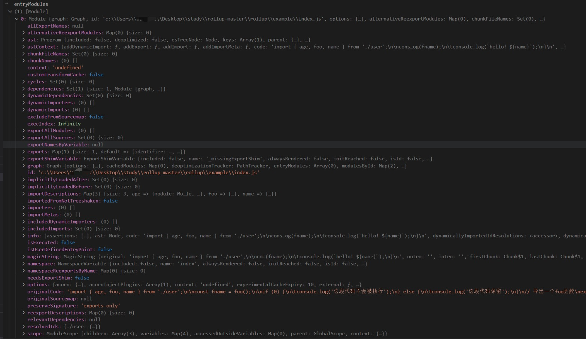

# generateModuleGraph

generateModuleGraph 方法的主要职责就是构建模块的“依赖图谱”。

在该方法的内部首先会调用 normalizeEntryModules(this.options.input) 方法将入口模块的 id 组成的数组通过包装加上一些 fileName、implicitlyLoadedAfter、name 等信息。请看如下示例：

```js
//转换前
// ['example/index.js']

// 通过 normalizeEntryModules 方法转换后的结果
// [{"fileName":null,"id":"example/index.js","implicitlyLoadedAfter":[],"name":null}]
```

经过上面的转换过程再调用 this.moduleLoader.addEntryModules 方法读取模块（文件）里的代码。然后得到 this.entryModules，和 this.implicitEntryModules。如果根据 input 的值未读取到任何模块信息，rollup 会报错提示“You must supply options.input to rollup”。意思就是你必须提供一个 input 选项。

如果 this.entryModules 存在模块信息，则进一步通过 module instanceof Module 判断这些模块是否是刚才创建的，是则执行 this.modules.push(module) 将模块保存起来。否则执行 this.externalModules.push(module) 逻辑。

```js
export default class Graph {
	//...
	private async generateModuleGraph(): Promise<void> {
		/**
		 * normalizeEntryModules(this.options.input) => '[{"fileName":null,"id":"example/index.js","implicitlyLoadedAfter":[],"name":null}]'
		 */
		({ entryModules: this.entryModules, implicitEntryModules: this.implicitEntryModules } =
			await this.moduleLoader.addEntryModules(normalizeEntryModules(this.options.input), true));
		if (this.entryModules.length === 0) {
			throw new Error('You must supply options.input to rollup');
		}
		for (const module of this.modulesById.values()) {
			if (module instanceof Module) {
				this.modules.push(module);
			} else {
				this.externalModules.push(module);
			}
		}
	}
}
```

接着继续深入 this.moduleLoader.addEntryModules 的方法，这个方法其实就是调用的 ModuleLoader.addEntryModules 方法。ModuleLoader 类定义在：src/ModuleLoader.ts

## addEntryModules

addEntryModules 方法接收两个参数：第一个参数是 unresolvedEntryModules，它是一个数组，保存着 module 信息。第二个参数是 isUserDefined，在刚才的方法调用中传入了 true，代表这个是用户定义的模块信息。addEntryModules 最终返回的是一个 Promise 对象，里面包含了 entryModules，implicitEntryModules，newEntryModules。

```js
export class ModuleLoader {
  //...
  async addEntryModules(
		unresolvedEntryModules: readonly UnresolvedModule[],
		isUserDefined: boolean
	): Promise<{
		entryModules: Module[];
		implicitEntryModules: Module[];
		newEntryModules: Module[];
	}> {
		const firstEntryModuleIndex = this.nextEntryModuleIndex;
		this.nextEntryModuleIndex += unresolvedEntryModules.length;
		const firstChunkNamePriority = this.nextChunkNamePriority;
		this.nextChunkNamePriority += unresolvedEntryModules.length;
		const newEntryModules = await this.extendLoadModulesPromise(
			Promise.all(
				unresolvedEntryModules.map(({ id, importer }) =>
					this.loadEntryModule(id, true, importer, null)
				)
			).then(entryModules => {
				// entryModules => [Module]
				for (const [index, entryModule] of entryModules.entries()) {
					entryModule.isUserDefinedEntryPoint =
						entryModule.isUserDefinedEntryPoint || isUserDefined;
					addChunkNamesToModule(
						entryModule,
						unresolvedEntryModules[index],
						isUserDefined,
						firstChunkNamePriority + index
					);
					const existingIndexedModule = this.indexedEntryModules.find(
						indexedModule => indexedModule.module === entryModule
					);
					if (!existingIndexedModule) {
						this.indexedEntryModules.push({
							index: firstEntryModuleIndex + index,
							module: entryModule
						});
					} else {
						existingIndexedModule.index = Math.min(
							existingIndexedModule.index,
							firstEntryModuleIndex + index
						);
					}
				}
				//排序入口模板
				this.indexedEntryModules.sort(({ index: indexA }, { index: indexB }) =>
					indexA > indexB ? 1 : -1
				);
				return entryModules;
			})
		);
		await this.awaitLoadModulesPromise();
		return {
			entryModules: this.indexedEntryModules.map(({ module }) => module),
			implicitEntryModules: [...this.implicitEntryModules],
			newEntryModules
		};
	}
  //...
}
```

我们深入函数内部分析：**unresolvedEntryModules 是一个数组，因为 rollup 支持多入口的配置。**接着调用 Promise.all(unresolvedEntryModules.map(({ id, importer }) => this.loadEntryModule(id, true, importer, null))) 将所有的入口模块通过调用 loadEntryModule 方法加载进来,然后得到 entryModules。

这个读取和生成 module 的逻辑有点多，下图是读取模块文件和生成模块信息之后的 entryModules 示例：



拿到 entryModules 信息之后再对其循环取出对应的模块信息执行 this.indexedEntryModules.push({ index: firstEntryModuleIndex + index, module: entryModule }) 将入口模块进行了排序保存到 this.indexedEntryModules 中。再继续将 this.indexedEntryModules 进行排序。最后将 entryModules，implicitEntryModules，newEntryModules return 出去。

我们来看这么一段代码：

```js
this.loadEntryModule(id, true, importer, null);
```

可以看到函数内部调用了 this.loadEntryModule 方法，这个方法接收了 4 个参数。第一个参数是模块 id。程序首次执行到这里的时候这个 id 的值就是“example/index.js”。第二个参数代表传入的这个模块是否为入口模块（isEntry）。第三个参数 importer 表示“被谁引入的”，因为是加载入口模块所以这个 importer 为 undefined。第四个参数是 implicitlyLoadedBefore 的标识，默认值是 null。它的作用是当程序根据 input 的值找不到对应入口文件的时候提示不同的内容。

细心的同学已经发现了，传入的 options.input 是"example/index.js"，这个字符串路径是一个相对路径并不能读取到文件呢。

## loadEntryModule

我们顺着思路继续往下查找 loadEntryModule 方法的定义，它的定义在 src/ModuleLoader.ts 的文件中：

```js
export class ModuleLoader {
	//...
private async loadEntryModule(
		unresolvedId: string,
		isEntry: boolean,
		importer: string | undefined,
		implicitlyLoadedBefore: string | null
	): Promise<Module> {
		//resolveIdResult => 'c:\\Users\\**\\Desktop\\study\\rollup-master\\rollup\\example\\index.js'
		const resolveIdResult = await resolveId(
			unresolvedId,
			importer,
			this.options.preserveSymlinks,
			this.pluginDriver,
			this.resolveId,
			null,
			EMPTY_OBJECT,
			true,
			EMPTY_OBJECT
		);
		if (resolveIdResult == null) {
			return error(
				implicitlyLoadedBefore === null
					? errorUnresolvedEntry(unresolvedId)
					: errorUnresolvedImplicitDependant(unresolvedId, implicitlyLoadedBefore)
			);
		}
		if (
			resolveIdResult === false ||
			(typeof resolveIdResult === 'object' && resolveIdResult.external)
		) {
			return error(
				implicitlyLoadedBefore === null
					? errorEntryCannotBeExternal(unresolvedId)
					: errorImplicitDependantCannotBeExternal(unresolvedId, implicitlyLoadedBefore)
			);
		}
		return this.fetchModule(
			this.getResolvedIdWithDefaults(
				typeof resolveIdResult === 'object'
					? (resolveIdResult as NormalizedResolveIdWithoutDefaults)
					: { id: resolveIdResult },
				EMPTY_OBJECT
			)!,
			undefined,
			isEntry,
			false
		);
	}
}
```

## resolveId

loadEntryModule 方法内部首先调用了 resolveId 方法。这个方法定义在 src/utils/resolveId.ts 文件中：

```js
export async function resolveId(
	source: string,
	importer: string | undefined,
	preserveSymlinks: boolean,
	pluginDriver: PluginDriver,
	moduleLoaderResolveId: ModuleLoaderResolveId,
	skip: readonly { importer: string | undefined; plugin: Plugin; source: string }[] | null,
	customOptions: CustomPluginOptions | undefined,
	isEntry: boolean,
	assertions: Record<string, string>
): Promise<ResolveIdResult> {
	const pluginResult = await resolveIdViaPlugins(
		source,
		importer,
		pluginDriver,
		moduleLoaderResolveId,
		skip,
		customOptions,
		isEntry,
		assertions
	);
	if (pluginResult != null) return pluginResult;

	// external modules (non-entry modules that start with neither '.' or '/')
	// are skipped at this stage.  自动跳过不以“.”或者“/”开头的外部模块
	if (importer !== undefined && !isAbsolute(source) && source[0] !== '.') return null;

	// `resolve` processes paths from right to left, prepending them until an
	// absolute path is created. Absolute importees therefore shortcircuit the
	// resolve call and require no special handing on our part.
	// See https://nodejs.org/api/path.html#path_path_resolve_paths
	/**
	 * path.resolve() 该方法将一些的 路径/路径段 解析为绝对路径。
	 * 语法：path.resolve( [from…],to )
	 * 说明：将参数to位置的字符解析到一个绝对路径里，[from … ]为选填项，路径源
	 * 用法：
	 * path.resolve('/foo/bar', './baz')             // returns '/foo/bar/baz'
	 * path.resolve('/foo/bar', 'baz')               // returns '/foo/bar/baz'
	 * path.resolve('/foo/bar', '/baz')              // returns '/baz'
	 * path.resolve('/foo/bar', '../baz')            // returns '/foo/baz'
	 * path.resolve('home','/foo/bar', '../baz')     // returns '/foo/baz'
	 * path.resolve('home','./foo/bar', '../baz')    // returns '/home/foo/baz'
	 * path.resolve('home','foo/bar', '../baz')      // returns '/home/foo/baz'
	 * path.resolve('home', 'foo', 'build','aaaa','aadada','../../..', 'asset')  // return '/home/foo/asset'
	 * 总结：从后向前，若字符以 / 开头，不会拼接到前面的路径；若以 …/ 开头，拼接前面的路径，且不含最后一节路径；
	 * 若连续出现多个…/…/…或者…/…则忽略前方…个路径名进行拼接；若以 ./ 开头 或者没有符号 则拼接前面路径；
	 * path.resolve总是返回一个以相对于当前的工作目录（working directory）的绝对路径。
	 */
	return addJsExtensionIfNecessary(
		importer ? resolve(dirname(importer), source) : resolve(source),
		preserveSymlinks
	);
}

async function addJsExtensionIfNecessary(
	file: string,
	preserveSymlinks: boolean
): Promise<string | undefined> {
	//file => 'c:\Users\**\Desktop\study\rollup-master\rollup\example\user'
	return (
		(await findFile(file, preserveSymlinks)) ??
		(await findFile(file + '.mjs', preserveSymlinks)) ??
		(await findFile(file + '.js', preserveSymlinks))
	);
}

async function findFile(file: string, preserveSymlinks: boolean): Promise<string | undefined> {
	try {
		const stats = await fs.lstat(file);
		//stats.isSymbolicLink() 返回true，证明是软链接地址
		if (!preserveSymlinks && stats.isSymbolicLink())
			return await findFile(await fs.realpath(file), preserveSymlinks);
		if ((preserveSymlinks && stats.isSymbolicLink()) || stats.isFile()) {
			// check case
			const name = basename(file);
			const files = await fs.readdir(dirname(file));

			if (files.includes(name)) return file;
		}
	} catch {
		// suppress
	}
}

```

总结一下，我们的 options.input 值是 "example/index.js"，在 resolveId 方法内部处理入口模块的逻辑的时候，importer 为 undefined。因此会调用 path.resolve(source) 方法得到一个文件路径，接着继续调用 findFile 方法去找对应的文件。如果我们带上了文件扩展名则根据 await findFile(file, preserveSymlinks)) 这段代码就能拿到对应的文件。否则再用'.mjs'的文件扩展名去查找如果找不到继续用'.js'的文件扩展名去查找。最终找到文件再 return 出去。因此最终在 loadEntryModule 方法中调用 resolveId 方法会得到 resolveIdResult。这个 resolveIdResult 就是一个带上文件扩展名的完整路径。

拿到了完整的文件路径之后，通过条件语句分析可以看到最后走到了 return this.fetchModule 的逻辑。this.fetchModule 方法的第一个参数是通过调用 this.getResolvedIdWithDefaults 方法获取的。

```js
private getResolvedIdWithDefaults(
		resolvedId: NormalizedResolveIdWithoutDefaults | null,
		assertions: Record<string, string>
	): ResolvedId | null {
		if (!resolvedId) {
			return null;
		}
		const external = resolvedId.external || false;
		return {
			assertions: resolvedId.assertions || assertions,
			external,
			id: resolvedId.id,
			meta: resolvedId.meta || {},
			moduleSideEffects:
				resolvedId.moduleSideEffects ?? this.hasModuleSideEffects(resolvedId.id, !!external),
			syntheticNamedExports: resolvedId.syntheticNamedExports ?? false
		};
	}
```

通过代码可以看到实际上这个 getResolvedIdWithDefaults 的作用就是将得到的 resolveIdResult 转换成一个 ResolvedId 对象，它的结构如下所示：

```json
//ResolvedId
{
  "assertions": {},
  "id": "c:\\Users\\**\\Desktop\\study\\rollup-master\\rollup\\example\\index.js",
  "meta": {},
  "moduleSideEffects": true,
  "syntheticNamedExports": false
}
```

## fetchModule

fetchModule 的方法命名意图很明显--获取模块。

fetchModule 函数逻辑稍微有点复杂，我总结了它的主要逻辑如下：

- 第一步： 通过 id 从 this.modulesById 中读取缓存过的 module 信息。如果找到了对应的 module 就直接返回，否则继续第二步的逻辑。
- 第二步： 执行 new Module 得到 module 实例。顺带将当前模块通过 id 为 key 保存到 this.modulesById 的 Map 对象中以便于下次直接从缓存中获取模块提升性能。同时将这个模块的 id 保存到 this.graph.watchFiles 对象中。
- 第三步：调用 this.addModuleSource 读取文件中的源码并且更新 module.originalCode,module.info,module.astContext,module.ast，以及创建 module.scope 等等。
- 第四步：调用 this.fetchModuleDependencies(module, ...resolveDependencyPromises) 方法获取相关的依赖模块。**注意，在这个步骤当中如果发现当前的 module 导入了其他模块，那么程序会递归 this.fetchModule(resolvedId, importer, false, false) 函数直至找出所有的依赖模块并且生成 module 信息并返回。**
- 第五步：返回 module 对象。

```js
export class ModuleLoader {
	//...
private async fetchModule(
		{ assertions, id, meta, moduleSideEffects, syntheticNamedExports }: ResolvedId,
		importer: string | undefined,
		isEntry: boolean,
		isPreload: PreloadType
	): Promise<Module> {
		//程序首次执行到这里的时候this.modulesById是一个空的记录，因此existingModule为undefined
		const existingModule = this.modulesById.get(id);
		if (existingModule instanceof Module) {
			if (importer && doAssertionsDiffer(assertions, existingModule.info.assertions)) {
				this.options.onwarn(
					errorInconsistentImportAssertions(
						existingModule.info.assertions,
						assertions,
						id,
						importer
					)
				);
			}
			await this.handleExistingModule(existingModule, isEntry, isPreload);
			return existingModule;
		}

		const module = new Module(
			this.graph,
			id,
			this.options,
			isEntry,
			moduleSideEffects,
			syntheticNamedExports,
			meta,
			assertions
		);
		this.modulesById.set(id, module);
		this.graph.watchFiles[id] = true;
		const loadPromise: LoadModulePromise = this.addModuleSource(id, importer, module).then(() => [
			this.getResolveStaticDependencyPromises(module),
			this.getResolveDynamicImportPromises(module),
			loadAndResolveDependenciesPromise
		]);
		//...
		this.moduleLoadPromises.set(module, loadPromise);
		const resolveDependencyPromises = await loadPromise;
		if (!isPreload) {
			// 加载依赖模块
			await this.fetchModuleDependencies(module, ...resolveDependencyPromises);
		} else if (isPreload === RESOLVE_DEPENDENCIES) {
			await loadAndResolveDependenciesPromise;
		}
		return module;
	}
}
```

fetchModule 方法的逻辑流程走完之后，主程序的调用栈回到了 addEntryModules 函数内部。我们先回顾下 addEntryModules 的代码：

```js
export class ModuleLoader {
	//...
async addEntryModules(
		unresolvedEntryModules: readonly UnresolvedModule[],
		isUserDefined: boolean
	): Promise<{
		entryModules: Module[];
		implicitEntryModules: Module[];
		newEntryModules: Module[];
	}> {
		const firstEntryModuleIndex = this.nextEntryModuleIndex;
		this.nextEntryModuleIndex += unresolvedEntryModules.length;
		const firstChunkNamePriority = this.nextChunkNamePriority;
		this.nextChunkNamePriority += unresolvedEntryModules.length;
		const newEntryModules = await this.extendLoadModulesPromise(
			Promise.all(
				unresolvedEntryModules.map(({ id, importer }) =>
					this.loadEntryModule(id, true, importer, null)
				)
			).then(entryModules => {
				// entryModules => [Module]
				for (const [index, entryModule] of entryModules.entries()) {
					entryModule.isUserDefinedEntryPoint =
						entryModule.isUserDefinedEntryPoint || isUserDefined;
					addChunkNamesToModule(
						entryModule,
						unresolvedEntryModules[index],
						isUserDefined,
						firstChunkNamePriority + index
					);
					const existingIndexedModule = this.indexedEntryModules.find(
						indexedModule => indexedModule.module === entryModule
					);
					if (!existingIndexedModule) {
						this.indexedEntryModules.push({
							index: firstEntryModuleIndex + index,
							module: entryModule
						});
					} else {
						existingIndexedModule.index = Math.min(
							existingIndexedModule.index,
							firstEntryModuleIndex + index
						);
					}
				}
				//排序入口模板
				this.indexedEntryModules.sort(({ index: indexA }, { index: indexB }) =>
					indexA > indexB ? 1 : -1
				);
				return entryModules;
			})
		);
		await this.awaitLoadModulesPromise();
		return {
			entryModules: this.indexedEntryModules.map(({ module }) => module),
			implicitEntryModules: [...this.implicitEntryModules],
			newEntryModules
		};
	}
}
```

接下来程序会执行到如下代码。我们将关注点放在 then 方法的内部：

then 方法的内部获取的 entryModules 就是所有的入口模块元素组成的数组。then 方法内部首先会调用 entryModules.entries() 对这个数组进行遍历，接着调用 addChunkNamesToModule 方法设置 module.chunkFileNames。然后会判断 this.indexedEntryModules 数组中是否存在当前的 module,如果存在则重新设置 existingIndexedModule.index。否则执行 this.indexedEntryModules.push() 方法将入口模块收集到数组中。最后对 this.indexedEntryModules 按照 module.index 的值作升序排序。最终将 entryModules return 出去。

```js
Promise.all(
  unresolvedEntryModules.map(({ id, importer }) => this.loadEntryModule(id, true, importer, null))
).then(entryModules => {
  // entryModules => [Module]
  for (const [index, entryModule] of entryModules.entries()) {
    entryModule.isUserDefinedEntryPoint = entryModule.isUserDefinedEntryPoint || isUserDefined;
    addChunkNamesToModule(
      entryModule,
      unresolvedEntryModules[index],
      isUserDefined,
      firstChunkNamePriority + index
    );
    const existingIndexedModule = this.indexedEntryModules.find(
      indexedModule => indexedModule.module === entryModule
    );
    if (!existingIndexedModule) {
      this.indexedEntryModules.push({
        index: firstEntryModuleIndex + index,
        module: entryModule
      });
    } else {
      existingIndexedModule.index = Math.min(
        existingIndexedModule.index,
        firstEntryModuleIndex + index
      );
    }
  }
  //排序入口模板（按照module.index的值作升序排序）
  this.indexedEntryModules.sort(({ index: indexA }, { index: indexB }) =>
    indexA > indexB ? 1 : -1
  );
  return entryModules;
});
```

then 方法内部逻辑走完，主程序调用栈交给了 addEntryModules 方法。最终 addEntryModules 返回了包含 entryModules、implicitEntryModules、newEntryModules 的对象。紧接又回到了 generateModuleGraph 方法内部。代码定义在 src/Graph.ts：

```js
export default class Graph {
	//...
private async generateModuleGraph(): Promise<void> {
		({ entryModules: this.entryModules, implicitEntryModules: this.implicitEntryModules } =
			await this.moduleLoader.addEntryModules(normalizeEntryModules(this.options.input), true));
		if (this.entryModules.length === 0) {
			throw new Error('You must supply options.input to rollup');
		}
		for (const module of this.modulesById.values()) {
			if (module instanceof Module) {
				this.modules.push(module);
			} else {
				this.externalModules.push(module);
			}
		}
	}
}
```

generateModuleGraph 方法里面调用了 this.moduleLoader.addEntryModules 方法获取到 this.entryModules 和 this.implicitEntryModules。然后会进行 if 条件判断，如果 this.entryModules.length === 0 则证明找不到入口模块，rollup 会抛出一个错误提示'You must supply options.input to rollup'。否则通过 this.modulesById.values() 拿到所有的 module 进行循环判断是否是 Module 实例，是则执行 this.modules.push(module);否则执行 this.externalModules.push(module)记录外部模块。

## 总结

经过前面漫长的代码流程分析，我们了解了 graph 在执行 this.generateModuleGraph 方法的总体流程。这个过程我把它称作 “构建依赖图谱”。下一章节我们接着分析模块排序的业务逻辑。
