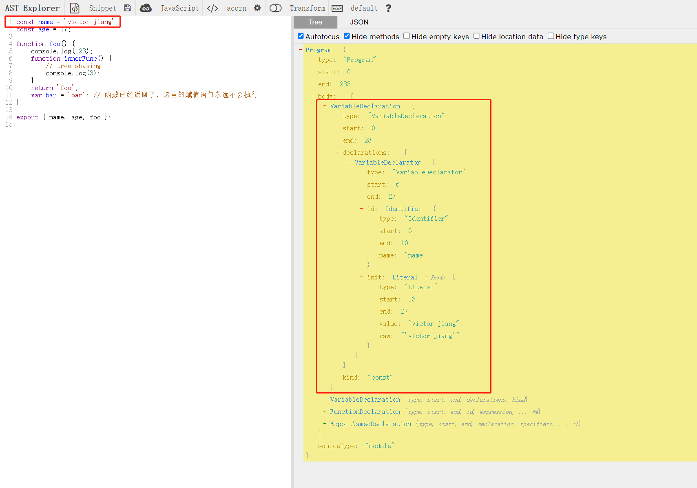
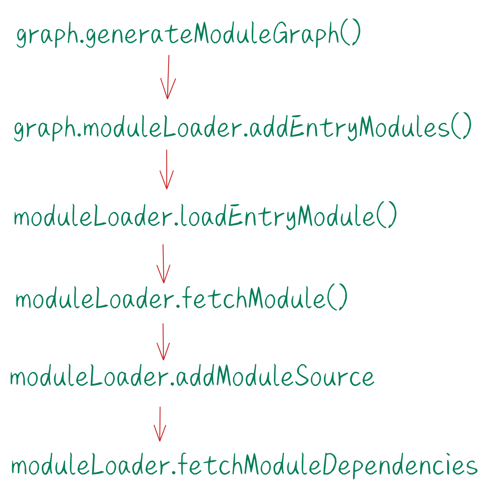

# generateModuleGraph

generateModuleGraph 方法的主要职责就是构建模块的“依赖图谱”。

在该方法的内部首先会调用 normalizeEntryModules(this.options.input) 方法将入口模块的 id 组成的数组通过包装加上一些 fileName、implicitlyLoadedAfter、name 等信息。请看如下示例：

```js
//转换前
// ['example/index.js']

// 通过 normalizeEntryModules 方法转换后的结果
// [{"fileName":null,"id":"example/index.js","implicitlyLoadedAfter":[],"name":null}]
```

经过上面的转换过程再调用 this.moduleLoader.addEntryModules 方法读取模块（文件）里的代码。然后得到 this.entryModules，和 this.implicitEntryModules。如果根据 input 的值未读取到任何模块信息，rollup 会报错“You must supply options.input to rollup”。意思就是你必须提供一个 input 选项。

如果 this.entryModules 存在模块信息，则进一步通过 module instanceof Module 判断这些模块是否是刚才创建的，是则执行 this.modules.push(module) 将模块保存起来。否则执行 this.externalModules.push(module) 逻辑。

```js
export default class Graph {
	//...
	private async generateModuleGraph(): Promise<void> {
		/**
		 * normalizeEntryModules(this.options.input) => '[{"fileName":null,"id":"example/index.js","implicitlyLoadedAfter":[],"name":null}]'
		 */
		({ entryModules: this.entryModules, implicitEntryModules: this.implicitEntryModules } =
			await this.moduleLoader.addEntryModules(normalizeEntryModules(this.options.input), true));
		if (this.entryModules.length === 0) {
			throw new Error('You must supply options.input to rollup');
		}
		for (const module of this.modulesById.values()) {
			if (module instanceof Module) {
				this.modules.push(module);
			} else {
				this.externalModules.push(module);
			}
		}
	}
}
```

接着继续深入 this.moduleLoader.addEntryModules 的方法，这个方法其实就是调用的 ModuleLoader.addEntryModules 方法。ModuleLoader 类定义在：src/ModuleLoader.ts

## addEntryModules

addEntryModules 方法接收两个参数：第一个参数是 unresolvedEntryModules，它是一个数组，保存着 module 信息。第二个参数是 isUserDefined，在刚才的方法调用中传入了 true，代表这个是用户定义的模块信息。addEntryModules 最终返回的是一个 Promise 对象，里面包含了 entryModules，implicitEntryModules，newEntryModules。

```js
export class ModuleLoader {
  //...
  async addEntryModules(
		unresolvedEntryModules: readonly UnresolvedModule[],
		isUserDefined: boolean
	): Promise<{
		entryModules: Module[];
		implicitEntryModules: Module[];
		newEntryModules: Module[];
	}> {
		const firstEntryModuleIndex = this.nextEntryModuleIndex;
		this.nextEntryModuleIndex += unresolvedEntryModules.length;
		const firstChunkNamePriority = this.nextChunkNamePriority;
		this.nextChunkNamePriority += unresolvedEntryModules.length;
		const newEntryModules = await this.extendLoadModulesPromise(
			Promise.all(
				unresolvedEntryModules.map(({ id, importer }) =>
					this.loadEntryModule(id, true, importer, null)
				)
			).then(entryModules => {
				// entryModules => [Module]
				for (const [index, entryModule] of entryModules.entries()) {
					entryModule.isUserDefinedEntryPoint =
						entryModule.isUserDefinedEntryPoint || isUserDefined;
					addChunkNamesToModule(
						entryModule,
						unresolvedEntryModules[index],
						isUserDefined,
						firstChunkNamePriority + index
					);
					const existingIndexedModule = this.indexedEntryModules.find(
						indexedModule => indexedModule.module === entryModule
					);
					if (!existingIndexedModule) {
						this.indexedEntryModules.push({
							index: firstEntryModuleIndex + index,
							module: entryModule
						});
					} else {
						existingIndexedModule.index = Math.min(
							existingIndexedModule.index,
							firstEntryModuleIndex + index
						);
					}
				}
				//排序入口模板
				this.indexedEntryModules.sort(({ index: indexA }, { index: indexB }) =>
					indexA > indexB ? 1 : -1
				);
				return entryModules;
			})
		);
		await this.awaitLoadModulesPromise();
		return {
			entryModules: this.indexedEntryModules.map(({ module }) => module),
			implicitEntryModules: [...this.implicitEntryModules],
			newEntryModules
		};
	}
  //...
}
```

我们深入函数内部分析：**unresolvedEntryModules 是一个数组，因为 rollup 支持多入口的配置。**接着调用 Promise.all(unresolvedEntryModules.map(({ id, importer }) => this.loadEntryModule(id, true, importer, null))) 将所有的入口模块通过调用 loadEntryModule 方法加载进来,然后得到 entryModules。

这个读取和生成 module 的逻辑有点多，下图是读取模块文件和生成模块信息之后的 entryModules 示例：


拿到 entryModules 信息之后再对其循环取出对应的模块信息执行 this.indexedEntryModules.push({ index: firstEntryModuleIndex + index, module: entryModule }) 将入口模块进行了排序保存到 this.indexedEntryModules 中。再继续将 this.indexedEntryModules 进行排序。最后将 entryModules，implicitEntryModules，newEntryModules return 出去。

我们来看这么一段代码：

```js
this.loadEntryModule(id, true, importer, null);
```

可以看到函数内部调用了 this.loadEntryModule 方法，这个方法接收了 4 个参数。第一个参数是模块 id。程序首次执行到这里的时候这个 id 的值就是“example/index.js”。第二个参数代表传入的这个模块是否为入口模块（isEntry）。第三个参数 importer 表示“被谁引入的”，因为是加载入口模块所以这个 importer 为 undefined。第四个参数是 implicitlyLoadedBefore 的标识，默认值是 null。它的作用是当程序根据 input 的值找不到对应入口文件的时候给出不同的提示信息。

细心的同学已经发现了，传入的 options.input 是"example/index.js"，这个字符串路径是一个相对路径并不能读取到文件呢。

原来在函数 loadEntryModule()的内部首先调用了 resolveId 方法帮我们将传入的文件相对路径转换成了绝对路径。

## loadEntryModule

我们看下 loadEntryModule 方法的定义，它的定义在 src/ModuleLoader.ts 的文件中：

```js
export class ModuleLoader {
	//...
private async loadEntryModule(
		unresolvedId: string,
		isEntry: boolean,
		importer: string | undefined,
		implicitlyLoadedBefore: string | null
	): Promise<Module> {
		//resolveIdResult => 'c:\\Users\\**\\Desktop\\study\\rollup-master\\rollup\\example\\index.js'
		const resolveIdResult = await resolveId(
			unresolvedId,
			importer,
			this.options.preserveSymlinks,
			this.pluginDriver,
			this.resolveId,
			null,
			EMPTY_OBJECT,
			true,
			EMPTY_OBJECT
		);
		if (resolveIdResult == null) {
			return error(
				implicitlyLoadedBefore === null
					? errorUnresolvedEntry(unresolvedId)
					: errorUnresolvedImplicitDependant(unresolvedId, implicitlyLoadedBefore)
			);
		}
		if (
			resolveIdResult === false ||
			(typeof resolveIdResult === 'object' && resolveIdResult.external)
		) {
			return error(
				implicitlyLoadedBefore === null
					? errorEntryCannotBeExternal(unresolvedId)
					: errorImplicitDependantCannotBeExternal(unresolvedId, implicitlyLoadedBefore)
			);
		}
		return this.fetchModule(
			this.getResolvedIdWithDefaults(
				typeof resolveIdResult === 'object'
					? (resolveIdResult as NormalizedResolveIdWithoutDefaults)
					: { id: resolveIdResult },
				EMPTY_OBJECT
			)!,
			undefined,
			isEntry,
			false
		);
	}
}
```

## resolveId

loadEntryModule 方法内部首先调用了 resolveId 方法。这个方法定义在 src/utils/resolveId.ts 文件中：

```js
export async function resolveId(
	source: string,
	importer: string | undefined,
	preserveSymlinks: boolean,
	pluginDriver: PluginDriver,
	moduleLoaderResolveId: ModuleLoaderResolveId,
	skip: readonly { importer: string | undefined; plugin: Plugin; source: string }[] | null,
	customOptions: CustomPluginOptions | undefined,
	isEntry: boolean,
	assertions: Record<string, string>
): Promise<ResolveIdResult> {
	const pluginResult = await resolveIdViaPlugins(
		source,
		importer,
		pluginDriver,
		moduleLoaderResolveId,
		skip,
		customOptions,
		isEntry,
		assertions
	);
	if (pluginResult != null) return pluginResult;

	// external modules (non-entry modules that start with neither '.' or '/')
	// are skipped at this stage.  自动跳过不以“.”或者“/”开头的外部模块
	if (importer !== undefined && !isAbsolute(source) && source[0] !== '.') return null;

	// `resolve` processes paths from right to left, prepending them until an
	// absolute path is created. Absolute importees therefore shortcircuit the
	// resolve call and require no special handing on our part.
	// See https://nodejs.org/api/path.html#path_path_resolve_paths
	/**
	 * path.resolve() 该方法将一些的 路径/路径段 解析为绝对路径。
	 * 语法：path.resolve( [from…],to )
	 * 说明：将参数to位置的字符解析到一个绝对路径里，[from … ]为选填项，路径源
	 * 用法：
	 * path.resolve('/foo/bar', './baz')             // returns '/foo/bar/baz'
	 * path.resolve('/foo/bar', 'baz')               // returns '/foo/bar/baz'
	 * path.resolve('/foo/bar', '/baz')              // returns '/baz'
	 * path.resolve('/foo/bar', '../baz')            // returns '/foo/baz'
	 * path.resolve('home','/foo/bar', '../baz')     // returns '/foo/baz'
	 * path.resolve('home','./foo/bar', '../baz')    // returns '/home/foo/baz'
	 * path.resolve('home','foo/bar', '../baz')      // returns '/home/foo/baz'
	 * path.resolve('home', 'foo', 'build','aaaa','aadada','../../..', 'asset')  // return '/home/foo/asset'
	 * 总结：从后向前，若字符以 / 开头，不会拼接到前面的路径；若以 …/ 开头，拼接前面的路径，且不含最后一节路径；
	 * 若连续出现多个…/…/…或者…/…则忽略前方…个路径名进行拼接；若以 ./ 开头 或者没有符号 则拼接前面路径；
	 * path.resolve总是返回一个以相对于当前的工作目录（working directory）的绝对路径。
	 */
	return addJsExtensionIfNecessary(
		importer ? resolve(dirname(importer), source) : resolve(source),
		preserveSymlinks
	);
}

async function addJsExtensionIfNecessary(
	file: string,
	preserveSymlinks: boolean
): Promise<string | undefined> {
	//file => 'c:\Users\**\Desktop\study\rollup-master\rollup\example\user'
	return (
		(await findFile(file, preserveSymlinks)) ??
		(await findFile(file + '.mjs', preserveSymlinks)) ??
		(await findFile(file + '.js', preserveSymlinks))
	);
}

async function findFile(file: string, preserveSymlinks: boolean): Promise<string | undefined> {
	try {
		const stats = await fs.lstat(file);
		//stats.isSymbolicLink() 返回true，证明是软链接地址
		if (!preserveSymlinks && stats.isSymbolicLink())
			return await findFile(await fs.realpath(file), preserveSymlinks);
		if ((preserveSymlinks && stats.isSymbolicLink()) || stats.isFile()) {
			// check case
			const name = basename(file);
			const files = await fs.readdir(dirname(file));

			if (files.includes(name)) return file;
		}
	} catch {
		// suppress
	}
}

```

总结一下，我们的 options.input 值是 "example/index.js"，在 resolveId 方法内部处理入口模块的逻辑的时候，importer 为 undefined。因此会调用 path.resolve(source) 方法得到一个文件路径，接着继续调用 findFile 方法去找对应的文件。如果我们带上了文件扩展名则根据 await findFile(file, preserveSymlinks)) 这段代码就能拿到对应的文件。否则再用'.mjs'的文件扩展名去查找如果找不到继续用'.js'的文件扩展名去查找。最终找到文件再 return 出去。因此最终在 loadEntryModule 方法中调用 resolveId 方法会得到 resolveIdResult。这个 resolveIdResult 就是一个带上文件扩展名的完整路径。

拿到了完整的文件路径之后，通过条件语句分析可以看到最后走到了 return this.fetchModule 的逻辑。this.fetchModule 方法的第一个参数是通过调用 this.getResolvedIdWithDefaults 方法获取的。

```js
private getResolvedIdWithDefaults(
		resolvedId: NormalizedResolveIdWithoutDefaults | null,
		assertions: Record<string, string>
	): ResolvedId | null {
		if (!resolvedId) {
			return null;
		}
		const external = resolvedId.external || false;
		return {
			assertions: resolvedId.assertions || assertions,
			external,
			id: resolvedId.id,
			meta: resolvedId.meta || {},
			moduleSideEffects:
				resolvedId.moduleSideEffects ?? this.hasModuleSideEffects(resolvedId.id, !!external),
			syntheticNamedExports: resolvedId.syntheticNamedExports ?? false
		};
	}
```

通过代码可以看到实际上这个 getResolvedIdWithDefaults 的作用就是将得到的 resolveIdResult 转换成一个 ResolvedId 对象，它的结构如下所示：

```json
//ResolvedId
{
  "assertions": {},
  "id": "c:\\Users\\**\\Desktop\\study\\rollup-master\\rollup\\example\\index.js",
  "meta": {},
  "moduleSideEffects": true,
  "syntheticNamedExports": false
}
```

## fetchModule

fetchModule 的方法命名意图很明显--获取模块。

fetchModule 函数逻辑稍微有点复杂，我总结了它的主要逻辑如下：

- 第一步： 通过 id 从 this.modulesById 中读取缓存过的 module 信息。如果找到了对应的 module 就直接返回，否则继续第二步的逻辑。
- 第二步： 执行 new Module 得到 module 实例。并且将当前模块通过 id 为 key 保存到 this.modulesById 的 Map 对象中以便于下次直接从缓存中获取模块提升性能。同时将这个模块的 id 保存到 this.graph.watchFiles 对象中。
- 第三步：调用 this.addModuleSource 读取文件中的源码并且更新 module.originalCode,module.info,module.astContext,module.ast，以及创建 module.scope 等等。
- 第四步：调用 this.fetchModuleDependencies(module, ...resolveDependencyPromises) 方法获取相关的依赖模块。**注意，在这个步骤当中如果发现当前的 module 导入了其他模块，那么程序会递归 this.fetchModule(resolvedId, importer, false, false) 函数直至找出所有的依赖模块并且生成 module 信息并返回。**
- 第五步：返回 module 对象。

```js
export class ModuleLoader {
	//...
private async fetchModule(
		{ assertions, id, meta, moduleSideEffects, syntheticNamedExports }: ResolvedId,
		importer: string | undefined,
		isEntry: boolean,
		isPreload: PreloadType
	): Promise<Module> {
		//程序首次执行到这里的时候this.modulesById是一个空的记录，因此existingModule为undefined
		const existingModule = this.modulesById.get(id);
		if (existingModule instanceof Module) {
			if (importer && doAssertionsDiffer(assertions, existingModule.info.assertions)) {
				this.options.onwarn(
					errorInconsistentImportAssertions(
						existingModule.info.assertions,
						assertions,
						id,
						importer
					)
				);
			}
			await this.handleExistingModule(existingModule, isEntry, isPreload);
			return existingModule;
		}

		const module = new Module(
			this.graph,
			id,
			this.options,
			isEntry,
			moduleSideEffects,
			syntheticNamedExports,
			meta,
			assertions
		);
		this.modulesById.set(id, module);
		this.graph.watchFiles[id] = true;
		const loadPromise: LoadModulePromise = this.addModuleSource(id, importer, module).then(() => [
			this.getResolveStaticDependencyPromises(module),
			this.getResolveDynamicImportPromises(module),
			loadAndResolveDependenciesPromise
		]);
		//...
		this.moduleLoadPromises.set(module, loadPromise);
		const resolveDependencyPromises = await loadPromise;
		if (!isPreload) {
			// 加载依赖模块
			await this.fetchModuleDependencies(module, ...resolveDependencyPromises);
		} else if (isPreload === RESOLVE_DEPENDENCIES) {
			await loadAndResolveDependenciesPromise;
		}
		return module;
	}
}
```

第一步中由于程序首次执行到这里 this.modulesById 为空。接着执行 new Module 生成 module 信息，再把 module.id 作为 key， module 为 value 存到 this.modulesById 这个 map 对象中方便后续直接获取模块信息。然后就是调用 this.addModuleSource 方法去设置模块的源码信息了。

## addModuleSource

addModuleSource 也是 ModuleLoader 类的一个私有方法。它主要是使用 fs.readFile 读取指定 id 的路径下的文件获取源码字符串 source。获取到 source 的时候将它包装成 sourceDescription 对象。此时程序到这里是没有 cachedModule 信息的。因此走的是 else 部分的逻辑。最后调用 module.updateOptions、module.setSource 来更新 module 信息。

```js
export class ModuleLoader {
	//...
private async addModuleSource(
		id: string,
		importer: string | undefined,
		module: Module
	): Promise<void> {
		let source: LoadResult;
		try {
			source = await this.graph.fileOperationQueue.run(
				async () =>
					(await this.pluginDriver.hookFirst('load', [id])) ?? (await fs.readFile(id, 'utf8'))
			);
		} catch (error_: any) {
			//...
		}
		const sourceDescription =
			typeof source === 'string'
				? { code: source }
				: source != null && typeof source === 'object' && typeof source.code === 'string'
				? source
				: error(errorBadLoader(id));
		const cachedModule = this.graph.cachedModules.get(id);
		if (
			cachedModule &&
			!cachedModule.customTransformCache &&
			cachedModule.originalCode === sourceDescription.code &&
			!(await this.pluginDriver.hookFirst('shouldTransformCachedModule', [
				{
					ast: cachedModule.ast,
					code: cachedModule.code,
					id: cachedModule.id,
					meta: cachedModule.meta,
					moduleSideEffects: cachedModule.moduleSideEffects,
					resolvedSources: cachedModule.resolvedIds,
					syntheticNamedExports: cachedModule.syntheticNamedExports
				}
			]))
		) {
			if (cachedModule.transformFiles) {
				for (const emittedFile of cachedModule.transformFiles)
					this.pluginDriver.emitFile(emittedFile);
			}
			module.setSource(cachedModule);
		} else {
			/**
			 * 更新module.info的moduleSideEffects、syntheticNamedExports、meta，默认都是undefined
			 */
			module.updateOptions(sourceDescription);
			module.setSource(
				await transform(sourceDescription, module, this.pluginDriver, this.options.onwarn)
			);
		}
	}
}
```

## setSource

module.setSource 的方法内部逻辑比较复杂，在此阶段才是最终创建 ast tree 并重新构造 ast node 的关键时机。代码定义在 src/Module.ts 文件中：

```js
export default class Module {
	//...
setSource({
		ast,
		code,
		customTransformCache,
		originalCode,
		originalSourcemap,
		resolvedIds,
		sourcemapChain,
		transformDependencies,
		transformFiles,
		...moduleOptions
	}: TransformModuleJSON & {
		resolvedIds?: ResolvedIdMap;
		transformFiles?: EmittedFile[] | undefined;
	}): void {
		timeStart('generate ast', 3);

		this.info.code = code;
		this.originalCode = originalCode;
		this.originalSourcemap = originalSourcemap;
		this.sourcemapChain = sourcemapChain;
		if (transformFiles) {
			this.transformFiles = transformFiles;
		}
		this.transformDependencies = transformDependencies;
		this.customTransformCache = customTransformCache;
		this.updateOptions(moduleOptions);

		if (!ast) {
			//调用acorn.parse()方法解析成ast
			ast = this.tryParse();
		}
		//...

		this.resolvedIds = resolvedIds || Object.create(null);

		// 使用“id”作为源文件名是有意义的
		const fileName = this.id;

		this.magicString = new MagicString(code, {
			filename: (this.excludeFromSourcemap ? null : fileName)!, // don't include plugin helpers in sourcemap
			indentExclusionRanges: []
		});
		//定义模块的context，包括根据import、export获取模块的导入和导出对象
		this.astContext = {
			addDynamicImport: this.addDynamicImport.bind(this),
			addExport: this.addExport.bind(this),
			addImport: this.addImport.bind(this),
			addImportMeta: this.addImportMeta.bind(this),
			code, // Only needed for debugging
			deoptimizationTracker: this.graph.deoptimizationTracker,
			error: this.error.bind(this),
			fileName, // Needed for warnings
			getExports: this.getExports.bind(this),
			getModuleExecIndex: () => this.execIndex,
			getModuleName: this.basename.bind(this),
			getNodeConstructor: (name: string) => nodeConstructors[name] || nodeConstructors.UnknownNode,
			getReexports: this.getReexports.bind(this),
			importDescriptions: this.importDescriptions,
			includeAllExports: () => this.includeAllExports(true),
			includeDynamicImport: this.includeDynamicImport.bind(this),
			includeVariableInModule: this.includeVariableInModule.bind(this),
			magicString: this.magicString,
			module: this,
			moduleContext: this.context,
			options: this.options,
			requestTreeshakingPass: () => (this.graph.needsTreeshakingPass = true),
			traceExport: (name: string) => this.getVariableForExportName(name)[0],
			traceVariable: this.traceVariable.bind(this),
			usesTopLevelAwait: false,
			warn: this.warn.bind(this)
		};
		//创建基于模块的作用域
		this.scope = new ModuleScope(this.graph.scope, this.astContext);
		//创建命名空间
		this.namespace = new NamespaceVariable(this.astContext);
		//创建Program,设置node.included = false初始化node属性和方法
		this.ast = new Program(ast, { context: this.astContext, type: 'Module' }, this.scope);
		this.info.ast = ast;

		timeEnd('analyze ast', 3);
	}

	tryParse(): acorn.Node {
		try {
			return this.graph.contextParse(this.info.code!);
		} catch (error_: any) {
			return this.error(errorParseError(error_, this.id), error_.pos);
		}
	}
}
```

setSource 的内部首先调用 this.updateOptions(moduleOptions) 更新 module.options。接着执行 this.tryParse() 来解析 ast 。this.tryParse() 方法内部实际上调用的是 this.graph.contextParse 方法，即使用 [acorn](https://github.com/acornjs/acorn) 来解析 ast。

在此有必要对 ast 先做下解释；抽象语法树（Abstract Syntax Tree，AST），是源代码语法结构的一种抽象表示。它以树状的形式表现编程语言的语法结构，树上的每个节点都表示源代码中的一种结构。举个例子，的我们经常使用的代码编辑器中语法的检查、代码错误提示、代码自动补全等等场景都有抽象语法树的应用。

由于 rollup 使用 acorn 来解释抽象语法树。借助 [astexplorer](https://astexplorer.net/) 分析工具查看我们例子中的代码 ast 的结构如图所示：



这个棵抽象语法树的根节点就是 Program,Program 表示整个程序。Program.start 表示程序的起始位置，Program.end 表示程序的结束位置。Program.body 代表程序中的所有程序语句。例如 body 的前面两个节点都是 node.type 为 VariableDeclaration 的语句，表示程序中的申明语句。body 节点中的第三个节点元素是一个 FunctionDeclaration 的语句，表示一个函数申明。body 节点中最后一句就是 ExportNamedDeclaration ,表示导出名称声明。所有的 javaScript ast 节点类型定义可以在 src/ast/nodes 中查看。

既然了解了什么是 ast 之后我们接着回到 setSource 函数内部。刚才讲解到代码执行 ast = this.tryParse(); 获取到这个模块的 ast 之后还初始化了 this.magicString。[MagicString](https://github.com/rich-harris/magic-string) 就是用来将 ast 转成 MagicString 对象，然后这个 MagicString 对象可以对 ast 执行字符串的删除、替换等操作。然后就是一系列的初始化操作。定义 this.astContext、this.scope、this.namespace、this.ast 等等。

this.astContext 会作为参数传递给 Program 这个类。它的作用是绑定上下文，用于提供 ast.node 使用 module 上的方法和属性。

this.scope 就是模块内作用域（ModuleScope）。ModuleScope 继承自 ChildScope，在这里就不继续展开了。相关代码定义可以在 src/ast/scopes 中找到。

this.namespace 就是用来描述带命名空间的变量的 NamespaceVariable 类。

然后就是执行 new Program 创建 Program 实例。它的主要作用包括：初始化 node 属性（例如设置 node.included = false）和方法。设置 module.astContext。重写 Program 结构，基于 NodeBase 扩展 node 节点，添加 sourceMap 信息等。相关代码定义在：src/ast/nodes/shared/Node.ts

```js
export class NodeBase extends ExpressionEntity implements ExpressionNode {
	declare annotations?: acorn.Comment[];
	context: AstContext;
	declare end: number;
	esTreeNode: acorn.Node;
	keys: string[];
	parent: Node | { context: AstContext; type: string };
	declare scope: ChildScope;
	declare start: number;
	declare type: keyof typeof NodeType;
	/**
	 * This will be populated during initialise if setAssignedValue is called.
	 */
	protected declare assignmentInteraction: NodeInteractionAssigned;
	/**
	 * Nodes can apply custom deoptimizations once they become part of the
	 * executed code. To do this, they must initialize this as false, implement
	 * applyDeoptimizations and call this from include and hasEffects if they have
	 * custom handlers
	 */
	protected deoptimized = false;

	constructor(
		esTreeNode: GenericEsTreeNode,
		parent: Node | { context: AstContext; type: string },
		parentScope: ChildScope
	) {
		super();
		this.esTreeNode = esTreeNode;
		this.keys = keys[esTreeNode.type] || getAndCreateKeys(esTreeNode);
		this.parent = parent;
		this.context = parent.context;
		this.createScope(parentScope);
		/**
		 * 这一步很重要：
		 * 重写Program结构，基于esTreeNode扩展node节点（实例化ast.nodes，并且继承node的方法和属性。例如将node.incluede设置为false等等）
		*/
		this.parseNode(esTreeNode);
		this.initialise();
		//添加sourceMap
		this.context.magicString.addSourcemapLocation(this.start);
		this.context.magicString.addSourcemapLocation(this.end);
	}

	addExportedVariables(
		_variables: readonly Variable[],
		_exportNamesByVariable: ReadonlyMap<Variable, readonly string[]>
	): void {}

	/**
	 * Override this to bind assignments to variables and do any initialisations that
	 * require the scopes to be populated with variables.
	 */
	bind(): void {
		for (const key of this.keys) {
			const value = (this as GenericEsTreeNode)[key];
			if (Array.isArray(value)) {
				for (const child of value) {
					child?.bind();
				}
			} else if (value) {
				value.bind();
			}
		}
	}

	/**
	 * Override if this node should receive a different scope than the parent scope.
	 */
	createScope(parentScope: ChildScope): void {
		this.scope = parentScope;
	}

	hasEffects(context: HasEffectsContext): boolean {
		if (!this.deoptimized) this.applyDeoptimizations();
		for (const key of this.keys) {
			const value = (this as GenericEsTreeNode)[key];
			if (value === null) continue;
			if (Array.isArray(value)) {
				for (const child of value) {
					if (child?.hasEffects(context)) return true;
				}
			} else if (value.hasEffects(context)) return true;
		}
		return false;
	}

	hasEffectsAsAssignmentTarget(context: HasEffectsContext, _checkAccess: boolean): boolean {
		return (
			this.hasEffects(context) ||
			this.hasEffectsOnInteractionAtPath(EMPTY_PATH, this.assignmentInteraction, context)
		);
	}

	include(
		context: InclusionContext,
		includeChildrenRecursively: IncludeChildren,
		_options?: InclusionOptions
	): void {
		if (!this.deoptimized) this.applyDeoptimizations();
		this.included = true;
		for (const key of this.keys) {
			const value = (this as GenericEsTreeNode)[key];
			if (value === null) continue;
			if (Array.isArray(value)) {
				for (const child of value) {
					child?.include(context, includeChildrenRecursively);
				}
			} else {
				value.include(context, includeChildrenRecursively);
			}
		}
	}

	includeAsAssignmentTarget(
		context: InclusionContext,
		includeChildrenRecursively: IncludeChildren,
		_deoptimizeAccess: boolean
	) {
		this.include(context, includeChildrenRecursively);
	}

	/**
	 * Override to perform special initialisation steps after the scope is initialised
	 */
	initialise(): void {}

	insertSemicolon(code: MagicString): void {
		if (code.original[this.end - 1] !== ';') {
			code.appendLeft(this.end, ';');
		}
	}

	parseNode(esTreeNode: GenericEsTreeNode): void {
		//重写esTreeNode的结构, 使用 for...of 遍历 Program 可枚举数据
		for (const [key, value] of Object.entries(esTreeNode)) {
			// That way, we can override this function to add custom initialisation and then call super.parseNode
			if (this.hasOwnProperty(key)) continue;
			if (key.charCodeAt(0) === 95 /* _ */) {
				if (key === ANNOTATION_KEY) {
					this.annotations = value;
				} else if (key === INVALID_COMMENT_KEY) {
					for (const { start, end } of value as acorn.Comment[])
						this.context.magicString.remove(start, end);
				}
			} else if (typeof value !== 'object' || value === null) {
				(this as GenericEsTreeNode)[key] = value;
			} else if (Array.isArray(value)) {
				//esTreeNode.body
				(this as GenericEsTreeNode)[key] = [];
				for (const child of value) {
					/**
					 * 遍历 esTreeNode.body 节点并且根据 node.type 实例化对应的节点Class。
					 * 举个例子，如下语句的node.type = "ImportDeclaration"
					 * import { age, foo, name } from './user';
					 * 那么就会执行 new ImportDeclaration(child, this, this.scope) 语句初始化node
					 *
					*/
					(this as GenericEsTreeNode)[key].push(
						child === null
							? null
							: new (this.context.getNodeConstructor(child.type))(child, this, this.scope)
					);
				}
			} else {
				(this as GenericEsTreeNode)[key] = new (this.context.getNodeConstructor(value.type))(
					value,
					this,
					this.scope
				);
			}
		}
	}

	render(code: MagicString, options: RenderOptions): void {
		for (const key of this.keys) {
			const value = (this as GenericEsTreeNode)[key];
			if (value === null) continue;
			if (Array.isArray(value)) {
				for (const child of value) {
					child?.render(code, options);
				}
			} else {
				value.render(code, options);
			}
		}
	}

	setAssignedValue(value: ExpressionEntity): void {
		this.assignmentInteraction = { args: [value], thisArg: null, type: INTERACTION_ASSIGNED };
	}

	shouldBeIncluded(context: InclusionContext): boolean {
		return this.included || (!context.brokenFlow && this.hasEffects(createHasEffectsContext()));
	}

	/**
	 * Just deoptimize everything by default so that when e.g. we do not track
	 * something properly, it is deoptimized.
	 * @protected
	 */
	protected applyDeoptimizations(): void {
		this.deoptimized = true;
		for (const key of this.keys) {
			const value = (this as GenericEsTreeNode)[key];
			if (value === null) continue;
			if (Array.isArray(value)) {
				for (const child of value) {
					child?.deoptimizePath(UNKNOWN_PATH);
				}
			} else {
				value.deoptimizePath(UNKNOWN_PATH);
			}
		}
		this.context.requestTreeshakingPass();
	}
}
```

所有的 ast.node 类型都是继承自 NodeBase 这个 class。NodeBase 自身定义了所有的 node 共有的一些属性和方法。例如：start 代表该节点的起始的字符串位置,end 代表该节点的结束的字符串位置。type 就是指该节点的类型。在程序执行 new Program 的时候会走到 NodeBase.constructor 方法里面。NodeBase 继承自 ExpressionEntity 这个类。在 ExpressionEntity 类定义了一个属性叫 included，并且初始值为 false。这代表所有的 node 节点刚初始化的时候，node.included 都为 false。

**rollup 在其官方 [Rework treeshaking algorithm](https://github.com/rollup/rollup/pull/1582) 中有介绍：一个 node 是否需要被包含到打包的最终代码中依靠 hasEffects() 来判断。通俗的来讲如果变量被重新赋值或者被改变了，那么执行 hasEffects()肯定是返回 true 的，代表这个节点应该被包含进打包的最终代码中。那么程序会将 node.included 设置为 true。否则当 node.included 为 false 程序在执行 treeshaking 操作的时候会调用 magicstring 将该节点对应的 node.start 位置至 node.end 位置的字符串进行删除或者替换来对源代码进行修改，最终实现消除无用代码的功能。**

在了解了 treeshaking 工作相关的思路之后我们再把关注点切回到 NodeBase.constructor 方法里面。

```js
//...
constructor(
		esTreeNode: GenericEsTreeNode,
		parent: Node | { context: AstContext; type: string },
		parentScope: ChildScope
	) {
		//调用ExpressionEntity初始化included = false
		super();
		//保留原来的node节点
		this.esTreeNode = esTreeNode;
		//复制并扩展节点
		this.keys = keys[esTreeNode.type] || getAndCreateKeys(esTreeNode);
		this.parent = parent;
		//这个context就是module.astContext,保留上下文是为了方便后续node调用module上的方法
		this.context = parent.context;
		//创建局部作用域
		this.createScope(parentScope);
		/**
		 * 这一步很重要：
		 * 深度遍历 esTree 重写 Program 结构，基于 esTreeNode 扩展 rollup 自己的 node 节点
		*/
		this.parseNode(esTreeNode);
		this.initialise();
		//添加sourceMap
		this.context.magicString.addSourcemapLocation(this.start);
		this.context.magicString.addSourcemapLocation(this.end);
	}
	//...
```

执行 this.parseNode(esTreeNode) 就是创建 node，这个过程是深度遍历优先算法。具体来看代码实现：

```js
//...
parseNode(esTreeNode: GenericEsTreeNode): void {
		//重写esTreeNode的结构, 使用 for...of 遍历 Program 可枚举数据
		for (const [key, value] of Object.entries(esTreeNode)) {
			// That way, we can override this function to add custom initialisation and then call super.parseNode
			if (this.hasOwnProperty(key)) continue;
			if (key.charCodeAt(0) === 95 /* _ */) {
				//ANNOTATION_KEY = '_rollupAnnotations'
				if (key === ANNOTATION_KEY) {
					this.annotations = value;
					//INVALID_COMMENT_KEY = '_rollupRemoved'
				} else if (key === INVALID_COMMENT_KEY) {
					for (const { start, end } of value as acorn.Comment[])
						this.context.magicString.remove(start, end);
				}
			} else if (typeof value !== 'object' || value === null) {
				(this as GenericEsTreeNode)[key] = value;
			} else if (Array.isArray(value)) {
				(this as GenericEsTreeNode)[key] = [];
				for (const child of value) {
					/**
					 * 遍历 esTreeNode.body 节点并且根据 node.type 创建对应的节点。
					 * 举个例子，如下语句的node.type = "ImportDeclaration"
					 * import { age, foo, name } from './user';
					 * 那么就会执行 new ImportDeclaration(child, this, this.scope) 语句初始化node
					 *
					*/
					(this as GenericEsTreeNode)[key].push(
						child === null
							? null
							: new (this.context.getNodeConstructor(child.type))(child, this, this.scope)
					);
				}
			} else {
				(this as GenericEsTreeNode)[key] = new (this.context.getNodeConstructor(value.type))(
					value,
					this,
					this.scope
				);
			}
		}
	}
	//...
```

esTreeNode 就是由 acorn.parse 之后得到的 ast 。parseNode 方法使用了 for of 语句对 ast 自身可枚举属性进行遍历。if (this.hasOwnProperty(key)) continue; 可以防止在 node 身上重复创建对应的 key。接下来又是 if-else 逻辑判断，key.charCodeAt(0) === 95 用来判断是否由下划线(\_)开头。ANNOTATION_KEY 表示注释节点。INVALID_COMMENT_KEY 表示这个节点会被删除。如果对应的 key 的 value 是 Array 类型则使用 for of 遍历所有子节点，如果 child 不为 null 则根据 child.type 创建对应的 node 实列。最后将这个 node 节点 push 进 this.key 的数组中。在执行 new (this.context.getNodeConstructor(child.type))(child, this, this.scope) 这段代码的时候，child.node 就开始创建，并且继承了 NodeBase 这个类并且又执行到了 NodeBase.constructor 里面的逻辑。走到 NodeBase.constructor 里面的逻辑又会执行到 this.parseNode(esTreeNode) ，这个时候就相当于深度遍历这个 node 并创建 child 节点。

这里我们举个例子有助于理解：例如在执行到 node.type === 'ImportDeclaration' 的时候，程序会调用 new (this.context.getNodeConstructor(child.type))(child, this, this.scope)，实际上就是调用了 new ImportDeclaration(child, this, this.scope) 去创建对应的 node 实例。前面三个参数 child 就是 node.child, this 就是父节点，this.scope 就是父节点的作用域。最后 else 里面的逻辑也是类似原理。

this.parseNode 执行完之后会执行到 this.initialise 方法。每个 node 对应的 initialise 方法不尽相同，还是拿 node.type === 'ImportDeclaration' 来举个例子：代码执行到 this.initialise 方法的时候，实际上会走到 ImportDeclaration.initialise 方法。代码定义在：src/ast/nodes/ImportDeclaration.ts 中：

```js
export default class ImportDeclaration extends NodeBase {
	declare assertions?: ImportAttribute[];
	declare needsBoundaries: true;
	declare source: Literal<string>;
	declare specifiers: (ImportSpecifier | ImportDefaultSpecifier | ImportNamespaceSpecifier)[];
	declare type: NodeType.tImportDeclaration;

	// Do not bind specifiers or assertions
	bind(): void {}

	hasEffects(): boolean {
		return false;
	}

	initialise(): void {
		this.context.addImport(this);
	}

	render(code: MagicString, _options: RenderOptions, nodeRenderOptions?: NodeRenderOptions): void {
		code.remove(nodeRenderOptions!.start!, nodeRenderOptions!.end!);
	}

	protected applyDeoptimizations() {}
}
```

ImportDeclaration.initialise() 执行就会调用 this.context.addImport(this) 。注意，这个 this.context 实际上就是 module.astContext 。因此最终会调用 module.astContext.addImport 方法来加载依赖模块。

首先看下 module.addImport 的代码定义：

```js
private addImport(node: ImportDeclaration): void {
		const source = node.source.value;
		this.addSource(source, node);
		for (const specifier of node.specifiers) {
			//判断是否是默认导入，例如 import Vue from 'Vue'
			const isDefault = specifier.type === NodeType.ImportDefaultSpecifier;
			//判断是否为带命名空间的导入，例如 import * as acorn from 'acorn';
			const isNamespace = specifier.type === NodeType.ImportNamespaceSpecifier;

			const name = isDefault ? 'default' : isNamespace ? '*' : specifier.imported.name;
			/*
			this.importDescriptions = {
				"age": {
						"module": null,
						"name": "age",
						"source": "./user",
						"start": 9
				},
				"foo": {
						"module": null,
						"name": "foo",
						"source": "./user",
						"start": 14
				},
				"name": {
						"module": null,
						"name": "name",
						"source": "./user",
						"start": 19
				}
			*/
			this.importDescriptions.set(specifier.local.name, {
				module: null as never, // filled in later
				name,
				source,
				start: specifier.start
			});
		}
	}
```

const source = node.source.value 就是拿到 import 语句中引入的"源"，即 node.source.value。然后使用 for of 循环 node.specifiers 并且将每个 specifiers 的节点添加到 this.importDescriptions 对象中。这样就得到了当前模块的 import 信息。并且将来在变量查找的时候通过 specifiers.source 就能找到该变量在哪个模块中定义的。这个地方非常巧妙的处理了模块间导入信息，建议多阅读几遍加深理解。其他节点的 initialise() 方法就不一一列举了，感兴趣的同学可以自行翻阅源码。

## 总结

new Program 执行的过程就是深度遍历 ast 然后创建自定义的 node。rollup 自定义的 node 扩展了原有的 ast.node。赋予了不同 nodeType 自身的属性和方法，例如 hasEffects 方法和 include 方法等等。这样扩展的目的就是为了可以准确的调用不同类型的 node.include 方法对节点自身进一步操作。其实在封装自定义的 node 类的行为上就是一个“策略模式”的应用。每个类型的 node 单独定义成一个类，并且各类型之间的属性和方法的实现各有区别，在调用 node.include 的时候他们会执行各自的 include 方法。这种做法无论在代码的可维护还是代码组织来看都是很值得借鉴的。

## fetchModule

分析完 this.addModuleSource 的逻辑，接着回到 ModuleLoader.fetchModule 方法：

这个函数内部的使用的 promise 函数比较多，我在这里先捋清楚函数调用顺序：

1. 执行 this.addModuleSource(id, importer, module) 获取并设置模块源码信息
2. 执行 waitForDependencyResolution(loadPromise)
3. 执行 this.moduleLoadPromises.set(module, loadPromise)
4. 执行 this.fetchModuleDependencies(module, ...resolveDependencyPromises) 设置模块的 dependences 和依赖模块的 importers。

```js
export class ModuleLoader {
	//...
private async fetchModule(
		{ assertions, id, meta, moduleSideEffects, syntheticNamedExports }: ResolvedId,
		importer: string | undefined,
		isEntry: boolean,
		isPreload: PreloadType
	): Promise<Module> {
		//...
		const loadPromise: LoadModulePromise = this.addModuleSource(id, importer, module).then(() => [
			this.getResolveStaticDependencyPromises(module),
			this.getResolveDynamicImportPromises(module),
			loadAndResolveDependenciesPromise
		]);
		const loadAndResolveDependenciesPromise = waitForDependencyResolution(loadPromise).then(() =>
			this.pluginDriver.hookParallel('moduleParsed', [module.info])
		);
		loadAndResolveDependenciesPromise.catch(() => {
			/* avoid unhandled promise rejections */
		});
		this.moduleLoadPromises.set(module, loadPromise);
		const resolveDependencyPromises = await loadPromise;
		if (!isPreload) {
			// 加载依赖模块
			await this.fetchModuleDependencies(module, ...resolveDependencyPromises);
		} else if (isPreload === RESOLVE_DEPENDENCIES) {
			await loadAndResolveDependenciesPromise;
		}
		return module;
	}
}
```

fetchModule 方法的逻辑流程走完之后，主程序的调用栈回到了 addEntryModules 函数内部。我们先回顾下 addEntryModules 的代码：

```js
export class ModuleLoader {
	//...
async addEntryModules(
		unresolvedEntryModules: readonly UnresolvedModule[],
		isUserDefined: boolean
	): Promise<{
		entryModules: Module[];
		implicitEntryModules: Module[];
		newEntryModules: Module[];
	}> {
		const firstEntryModuleIndex = this.nextEntryModuleIndex;
		this.nextEntryModuleIndex += unresolvedEntryModules.length;
		const firstChunkNamePriority = this.nextChunkNamePriority;
		this.nextChunkNamePriority += unresolvedEntryModules.length;
		const newEntryModules = await this.extendLoadModulesPromise(
			Promise.all(
				unresolvedEntryModules.map(({ id, importer }) =>
					this.loadEntryModule(id, true, importer, null)
				)
			).then(entryModules => {
				// entryModules => [Module]
				for (const [index, entryModule] of entryModules.entries()) {
					entryModule.isUserDefinedEntryPoint =
						entryModule.isUserDefinedEntryPoint || isUserDefined;
					addChunkNamesToModule(
						entryModule,
						unresolvedEntryModules[index],
						isUserDefined,
						firstChunkNamePriority + index
					);
					const existingIndexedModule = this.indexedEntryModules.find(
						indexedModule => indexedModule.module === entryModule
					);
					if (!existingIndexedModule) {
						this.indexedEntryModules.push({
							index: firstEntryModuleIndex + index,
							module: entryModule
						});
					} else {
						existingIndexedModule.index = Math.min(
							existingIndexedModule.index,
							firstEntryModuleIndex + index
						);
					}
				}
				//排序入口模板
				this.indexedEntryModules.sort(({ index: indexA }, { index: indexB }) =>
					indexA > indexB ? 1 : -1
				);
				return entryModules;
			})
		);
		await this.awaitLoadModulesPromise();
		return {
			entryModules: this.indexedEntryModules.map(({ module }) => module),
			implicitEntryModules: [...this.implicitEntryModules],
			newEntryModules
		};
	}
}
```

接下来程序会执行到如下代码。我们将关注点放在 then 方法的内部：

then 方法的内部获取的 entryModules 就是所有的入口模块元素组成的数组。then 方法内部首先会调用 entryModules.entries() 对这个数组进行遍历，接着调用 addChunkNamesToModule 方法设置 module.chunkFileNames。然后会判断 this.indexedEntryModules 数组中是否存在当前的 module,如果存在则重新设置 existingIndexedModule.index。否则执行 this.indexedEntryModules.push() 方法将入口模块收集到数组中。最后对 this.indexedEntryModules 按照 module.index 的值作升序排序。最终将 entryModules return 出去。

```js
Promise.all(
  unresolvedEntryModules.map(({ id, importer }) => this.loadEntryModule(id, true, importer, null))
).then(entryModules => {
  // entryModules => [Module]
  for (const [index, entryModule] of entryModules.entries()) {
    entryModule.isUserDefinedEntryPoint = entryModule.isUserDefinedEntryPoint || isUserDefined;
    addChunkNamesToModule(
      entryModule,
      unresolvedEntryModules[index],
      isUserDefined,
      firstChunkNamePriority + index
    );
    const existingIndexedModule = this.indexedEntryModules.find(
      indexedModule => indexedModule.module === entryModule
    );
    if (!existingIndexedModule) {
      this.indexedEntryModules.push({
        index: firstEntryModuleIndex + index,
        module: entryModule
      });
    } else {
      existingIndexedModule.index = Math.min(
        existingIndexedModule.index,
        firstEntryModuleIndex + index
      );
    }
  }
  //排序入口模板（按照module.index的值作升序排序）
  this.indexedEntryModules.sort(({ index: indexA }, { index: indexB }) =>
    indexA > indexB ? 1 : -1
  );
  return entryModules;
});
```

then 方法内部逻辑走完，主程序调用栈交给了 addEntryModules 方法。最终 addEntryModules 返回了包含 entryModules、implicitEntryModules、newEntryModules 的对象。紧接又回到了 generateModuleGraph 方法内部。代码定义在 src/Graph.ts：

```js
export default class Graph {
	//...
private async generateModuleGraph(): Promise<void> {
		({ entryModules: this.entryModules, implicitEntryModules: this.implicitEntryModules } =
			await this.moduleLoader.addEntryModules(normalizeEntryModules(this.options.input), true));
		if (this.entryModules.length === 0) {
			throw new Error('You must supply options.input to rollup');
		}
		for (const module of this.modulesById.values()) {
			if (module instanceof Module) {
				this.modules.push(module);
			} else {
				this.externalModules.push(module);
			}
		}
	}
}
```

generateModuleGraph 方法里面调用了 this.moduleLoader.addEntryModules 方法获取到 this.entryModules 和 this.implicitEntryModules。然后会进行 if 条件判断，如果 this.entryModules.length === 0 则证明找不到入口模块，rollup 会抛出一个错误提示'You must supply options.input to rollup'。否则通过 this.modulesById.values() 拿到所有的 module 进行循环判断是否是 Module 实例，是则执行 this.modules.push(module);否则执行 this.externalModules.push(module)记录外部模块。

## 总结

本章节从代码 await this.generateModuleGraph() 处开始分析 ，我们了解了 graph 在执行 this.generateModuleGraph 方法的总体流程。这个过程我把它称作 “构建依赖图谱”。我们可以通过下图更直观的看到整个流程：


