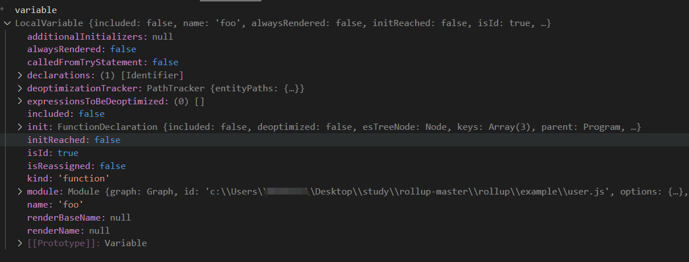

# sortModules

sortModules 主要做了两件事情：一个是排序模块,另一个就是绑定 node.variable，即绑定变量的引用信息。先看代码定义：src/Graph.ts

```js
export default class Graph {
  //...
  async build(): Promise<void> {
    //...
    await this.generateModuleGraph();
    this.sortModules();
    this.includeStatements();
  }

  private sortModules(): void {
		const { orderedModules, cyclePaths } = analyseModuleExecution(this.entryModules);
		for (const cyclePath of cyclePaths) {
			this.options.onwarn(errorCircularDependency(cyclePath));
		}
		this.modules = orderedModules;
		for (const module of this.modules) {
			//绑定变量的引用
			module.bindReferences();
		}
		//...
	}
  //...
}
```

sortModule 内部首先执行 analyseModuleExecution(this.entryModules) 。analyseModuleExecution 代码定义在：src/utils/executionOrder.ts

```js
function analyseModuleExecution(entryModules: readonly Module[]): {
	cyclePaths: string[][];
	orderedModules: Module[];
} {
	let nextExecIndex = 0;
	const cyclePaths: string[][] = [];
	const analysedModules = new Set<Module | ExternalModule>();
	const dynamicImports = new Set<Module>();
	const parents = new Map<Module | ExternalModule, Module | null>();
	const orderedModules: Module[] = [];

	const analyseModule = (module: Module | ExternalModule) => {
		if (module instanceof Module) {
      /**
       * 如果存在循环引入模块，例如 index.js 里面导入了 user.js, user.js 里面又导入了 index.js 则两者之间称为循环引用。
       * cyclePaths => [['c:\Users\**\Desktop\study\rollup-master\rollup\example\index.js', 'c:\Users\**\Desktop\study\rollup-master\rollup\example\user.js', 'c:\Users\**\Desktop\study\rollup-master\rollup\example\index.js']]
       */
			for (const dependency of module.dependencies) {
				if (parents.has(dependency)) {
					if (!analysedModules.has(dependency)) {
						cyclePaths.push(getCyclePath(dependency as Module, module, parents));
					}
					continue;
				}
				parents.set(dependency, module);
				analyseModule(dependency);
			}
			for (const dependency of module.implicitlyLoadedBefore) {
				dynamicImports.add(dependency);
			}
			for (const { resolution } of module.dynamicImports) {
				if (resolution instanceof Module) {
					dynamicImports.add(resolution);
				}
			}
			orderedModules.push(module);
		}

		module.execIndex = nextExecIndex++;
		analysedModules.add(module);
	};

	for (const currentEntry of entryModules) {
		if (!parents.has(currentEntry)) {
			parents.set(currentEntry, null);
			analyseModule(currentEntry);
		}
	}
  //分析动态导入模块
	for (const currentEntry of dynamicImports) {
		if (!parents.has(currentEntry)) {
			parents.set(currentEntry, null);
			analyseModule(currentEntry);
		}
	}

	return { cyclePaths, orderedModules };
}
```

analyseModuleExecution 方法内部首先会执行 for of 遍历 entryModules 对每个入口模块执行 analyseModule(currentEntry)。analyseModule 内部首先会判断传入的 module 是否为 rollup 创建的 module。如果是则对 module.dependencies 遍历，并对每个模块执行 analyseModule(dependency)，这样可以保证 orderedModules 里面的 module 排序的正确性。然后再对 dynamicImports 执行和 entryModules 一样的处理逻辑再次收集 orderedModules。最后将得到的 cyclePaths 和 orderedModules 返回。

通过代码分析可以得知，排序模块遵循的先后顺序为： dependencyModule > implicitlyLoadedBefore > dynamicImports。

分析完 analyseModuleExecution 的逻辑后我们再接着回到 sortModules 方法。sortModule 方法调用 analyseModuleExecution(this.entryModules) 拿到 orderedModules 和 cyclePaths。接着判断如果存在 cyclePaths 则会报警告 "Circular dependency"。再接着执行 this.modules = orderedModules 将排序好的模块信息保存到 this.modules。最后就是遍历 this.modules 执行 module.bindReferences()。

## module.bindReferences

module.bindReferences 其实就是绑定变量的引用信息。我们先找到对应的代码定义：src/Module.ts

```js
export default class Module {
	//...
bindReferences(): void {
		this.ast!.bind();
	}
}
```

bindReferences() 内部又执行了 this.ast.bind() 实际上执行的是 NodeBase.bind()。代码定义在 src/ast/nodes/shared/Node.ts

```js
class NodeBase {
//...
bind(): void {
		for (const key of this.keys) {
			const value = (this as GenericEsTreeNode)[key];
			if (Array.isArray(value)) {
				for (const child of value) {
					child?.bind();
				}
			} else if (value) {
				value.bind();
			}
		}
	}
	//...
}
```

bind 方法内部会对 this.keys 进行遍历操作，this 实际上就是源代码经过 acorn 转换的 ast 对象。

for of 代码块内部又判断了 value 的数据类型，如果是 Array 则遍历 value，对所有 childNode 都调用 bind()。否则直接调用 value.bind()。

在这里我们用 example/index.js 模块来举例：

```js
import { age, foo, name } from './user';
const fname = foo();
if (0) {
  console.log('这段代码不会被执行');
} else {
  console.log('这段代码保留');
}
// 导出一个foo函数
export default function hello() {
  console.log(fname);
  console.log(`hello! ${name}`);
}
```

index.js 模块经过转换 ast 对象之后的结构如下图所示：


由于 import { age, foo, name } from './user'; 语句不需要执行 bind() 。因此我们从 "const fname = foo();" 这行代码开始分析。在程序执行到 NodeBase.bind 时候，代码会执行到 child.bind()。 实际上执行的是 VariableDeclaration.bind()

VariableDeclaration 继承自 NodeBase。实际上在 rollup 中所有的 ast.node 都继承自 NodeBase。由于 VariableDeclaration 自身没有定义 bind 方法，因此最终还是执行 NodeBase.bind 方法。我们回顾下 NodeBase 的代码：

代码定义在 src/ast/nodes/shared/Node.ts

```js

export class NodeBase extends ExpressionEntity implements ExpressionNode {
	declare annotations?: acorn.Comment[];
	context: AstContext;
	declare end: number;
	esTreeNode: acorn.Node;
	keys: string[];
	parent: Node | { context: AstContext; type: string };
	declare scope: ChildScope;
	declare start: number;
	declare type: keyof typeof NodeType;
	/**
	 * This will be populated during initialise if setAssignedValue is called.
	 */
	protected declare assignmentInteraction: NodeInteractionAssigned;
	/**
	 * Nodes can apply custom deoptimizations once they become part of the
	 * executed code. To do this, they must initialize this as false, implement
	 * applyDeoptimizations and call this from include and hasEffects if they have
	 * custom handlers
	 */

	/**
	 * 节点在成为执行代码的一部分后，可以应用自定义deoptimizations方法。
	 * 为此，他们必须将 deoptimized 初始化为 false，
	 * 实现 applyDeoptimizations 并从 include 和 hasEffects 调用它（如果他们有自定义处理程序）
	 */
	protected deoptimized = false;

	constructor(
		esTreeNode: GenericEsTreeNode,
		parent: Node | { context: AstContext; type: string },
		parentScope: ChildScope
	) {
		//调用ExpressionEntity初始化included = false
		super();
		//保留原来的node节点
		this.esTreeNode = esTreeNode;
		//复制并扩展节点
		this.keys = keys[esTreeNode.type] || getAndCreateKeys(esTreeNode);
		this.parent = parent;
		//这个context就是module.astContext,保留上下文是为了方便后续node调用module上的方法
		this.context = parent.context;
		//创建局部作用域
		this.createScope(parentScope);
		/**
		 * 这一步很重要：
		 * 深度遍历 esTree 重写 Program 结构，基于 esTreeNode 扩展 rollup 自己的 node 节点
		*/
		this.parseNode(esTreeNode);
		this.initialise();
		//添加sourceMap
		this.context.magicString.addSourcemapLocation(this.start);
		this.context.magicString.addSourcemapLocation(this.end);
	}

	/**
	 * Override this to bind assignments to variables and do any initialisations that
	 * require the scopes to be populated with variables.
	 */
	bind(): void {
		for (const key of this.keys) {
			const value = (this as GenericEsTreeNode)[key];
			if (Array.isArray(value)) {
				for (const child of value) {
					child?.bind();
				}
			} else if (value) {
				value.bind();
			}
		}
	}

	//...
}
```

再次执行 bind 方法的时候，这个 this 就是指 VariableDeclaration 这个节点对象。如图：


VariableDeclaration 这个节点的 keys=['declarations'],因此 value = this[keys] 会得到 declarations。declarations 是一个数组对象，并且所有的 childNode.type = 'VariableDeclarator'。

VariableDeclarator 的代码定义在 src/ast/nodes/VariableDeclarator.ts

```js
export default class VariableDeclarator extends NodeBase {
  declare id: PatternNode;
  declare init: ExpressionNode | null;
  declare type: NodeType.tVariableDeclarator;
  //...
}
```

VariableDeclarator


由于 VariableDeclarator.bind 方法也是继承自 NodeBase。因此再次进入 NodeBase.bind 方法。VariableDeclarator.keys = ['id', 'init']。最后分别执行 Identifier.bind() 和 CallExpression.bind()

Identifier


## Identifier.bind()

我们先看 Identifier.bind 到底干了什么。它的代码定义在 src/ast/nodes/Identifier.ts

Identifier.bind 会判断如果当前作用域中没有找到变量定义，并且是一个引入（例如：node.type = Identifier 而且 node.parent.type=CallExpression）则执行 if 语句内部的逻辑。 this.variable = this.scope.findVariable(this.name); 表示需要根据 this.name 去 ModuleScope.variables(模块作用域)中或者外部的访问的变量中去查找变量定义。相关的逻辑定义在 ModuleScope.findVariable 方法中。

```js
export default class Identifier extends NodeBase implements PatternNode {
	declare name: string;
	declare type: NodeType.tIdentifier;
	variable: Variable | null = null;
	private isTDZAccess: boolean | null = null;
	//...
	bind(): void {
		//如果当前作用域中没有找到变量定义，并且是一个引入（例如：node.type = Identifier 而且 node.parent.type=CallExpression）
		if (!this.variable && isReference(this, this.parent as NodeWithFieldDefinition)) {
			this.variable = this.scope.findVariable(this.name);
			this.variable.addReference(this);
		}
	}
	//...
}
```

index.js 中的作用域对象如图示：


下面以 fname 和 foo 这两个 Identifier(标识符)分别进行分析：

- fname 是在当前模块定义的，所以在执行 Identifier.bind() 的时候 if 语句中的 this.variable.name 就是 'fname'。因此会跳过 bind 方法内部的 if 语句。
- foo 的定义实际上是在 user.js 模块中，index.js 模块中的作用域中无法查到这个 'foo'的定义 。因此代码会执行 this.accessedOutsideVariables.get(name)，this.context.traceVariable(name)，this.parent.findVariable(name) 这三个途径找 foo 函数的定义 。if (knownVariable) { return knownVariable } 代表在自身模块作用域中找到了，并且会返回这个变量定义。否则从上下文中找变量，也就是从 module.importDescriptions 对象中找,module.importDescriptions 中还未找到的话就查找 GlobalScope。最终找到这个 variable 的时候会判断 variable 是否是全局作用域下的变量。是则执行 this.accessedOutsideVariables.set(name, variable);将变量保存到表示外部访问到的变量对象中。最后返回这个 variable。到此为止 Identifier.bind() 的逻辑就分析完了。

src/ast/scopes/ModuleScope.ts

```js
export default class ModuleScope extends ChildScope {
  context: AstContext;
  declare parent: GlobalScope;

  constructor(parent: GlobalScope, context: AstContext) {
    super(parent);
    this.context = context;
    this.variables.set('this', new LocalVariable('this', null, UNDEFINED_EXPRESSION, context));
  }
  //...

  findVariable(name: string): Variable {
    //从自身模块或者外部找变量
    const knownVariable = this.variables.get(name) || this.accessedOutsideVariables.get(name);
    if (knownVariable) {
      return knownVariable;
    }
    //从上下文中找变量，也就是从自身模块的importDescriptions对象中找。
    const variable = this.context.traceVariable(name) || this.parent.findVariable(name);
    //如果是外部依赖module中的变量则保存起来方便下次访问
    if (variable instanceof GlobalVariable) {
      this.accessedOutsideVariables.set(name, variable);
    }
    return variable;
  }
  //...
}
```

## CallExpression.bind()

CallExpression 就是调用表达式，例如 foo() 就是一个 CallExpression。


CallExpression.bind 方法内部首先执行 super.bind() 对['callee', 'arguments']中的 key 分别执行 bind()。

- callee 代表名称，即 foo。foo 其实也是一个 Identifier(标识符)就是我们写 js 代码时自定义的名称，例如变量名，函数名，属性名，都可以称作标识符。因此执行 callee.bind()的时候就是执行前面我们分析过的 Identifier.bind()逻辑。最后找到了 foo 函数的定义。如图所示：



- arguments 代表函数的调用参数，不需要查找引用信息。

super.bind();逻辑分析完成之后。接着执行 if (this.callee instanceof Identifier) 语句，this.callee 就是 foo 函数。既然是个函数定义那么 this.callee instanceof Identifier 就会返回 true。因此程序会走 if 内部的逻辑。

const variable = this.scope.findVariable(this.callee.name); 这段代码表示从当前的 ModuleScope.variables 中查找 foo 函数，这里的 foo 函数不在当前模块中（index.js）所以会执行 this.context.traceVariable(name)，this.context.traceVariable() 就是指 module.traceVariable()。最后通过 module.importDescriptions.get(name) 找到了 foo 函数的定义。相关代码逻辑在 Module.ts 文件中：

```js
class Module {
  //...
  traceVariable(
    name: string,
    {
      importerForSideEffects,
      isExportAllSearch,
      searchedNamesAndModules
    }: {
      importerForSideEffects?: Module,
      isExportAllSearch?: boolean,
      searchedNamesAndModules?: Map<string, Set<Module | ExternalModule>>
    } = EMPTY_OBJECT
  ): Variable | null {
    //模块作用域变量
    const localVariable = this.scope.variables.get(name);
    if (localVariable) {
      return localVariable;
    }
    //import引入的变量
    const importDeclaration = this.importDescriptions.get(name);
    if (importDeclaration) {
      const otherModule = importDeclaration.module;

      if (otherModule instanceof Module && importDeclaration.name === '*') {
        return otherModule.namespace;
      }

      const [declaration] = getVariableForExportNameRecursive(
        otherModule,
        importDeclaration.name,
        importerForSideEffects || this,
        isExportAllSearch,
        searchedNamesAndModules
      );

      if (!declaration) {
        return this.error(
          errorMissingExport(importDeclaration.name, this.id, otherModule.id),
          importDeclaration.start
        );
      }

      return declaration;
    }

    return null;
  }
}
```

CallExpression 的代码定义：

```js
export default class CallExpression extends CallExpressionBase implements DeoptimizableEntity {
  declare arguments: (ExpressionNode | SpreadElement)[];
  declare callee: ExpressionNode | Super;
  declare optional: boolean;
  declare type: NodeType.tCallExpression;

  bind(): void {
    //调用父类的bind()方法
    super.bind();
    //如果执行了变量赋值、函数调用等操作则会去查询作用域中的变量
    if (this.callee instanceof Identifier) {
      const variable = this.scope.findVariable(this.callee.name);
      // 例如 import * as user from './user'; 的时候直接使用 user()而不是 user.foo(), 这个user就是一个namespace
      if (variable.isNamespace) {
        this.context.warn(errorCannotCallNamespace(this.callee.name), this.start);
      }
      //如果是eval()函数调用会警告
      if (this.callee.name === 'eval') {
        this.context.warn(errorEval(this.context.module.id), this.start);
      }
    }
    //定义调用方式
    this.interaction = {
      args: this.arguments, //函数参数
      thisArg:
        this.callee instanceof MemberExpression && !this.callee.variable
          ? this.callee.object
          : null,
      type: INTERACTION_CALLED, //2,标记为 'call' 调用
      withNew: false //是否是 new 调用
    };
  }
  //...
}
```

获取到 variable 之后如果发现调用或者赋值命名空间的话会报警告，如果是 eval 函数调用也会报警告。最后定义了 this.interaction 对象表示函数的调用方式。
