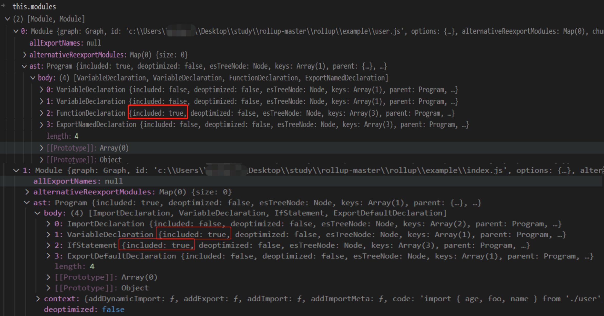

## module.includeAllExports

上一节我们分析 module.include() 的逻辑执行完之后会将所有模块里的节点更新 included 标记。 如图示：



请注意上图中 user 和 index 模块中的 ast.body 已经标记为 included: true 的部分，表示对应的 ast 节点是 “hasEffects” 的。

我们回到 includeStatements 方法内部：src/Graph.ts

```ts
//Graph.ts

private includeStatements(): void {
  for (const module of [...this.entryModules, ...this.implicitEntryModules]) {
    //标记模块 isExecuted = true;
    markModuleAndImpureDependenciesAsExecuted(module);
  }
  if (this.options.treeshake) {
    let treeshakingPass = 1;
    do {
      timeStart(`treeshaking pass ${treeshakingPass}`, 3);
      this.needsTreeshakingPass = false;
      for (const module of this.modules) {
        if (module.isExecuted) {
          if (module.info.moduleSideEffects === 'no-treeshake') {
            module.includeAllInBundle();
          } else {
            module.include();
          }
        }
      }
      if (treeshakingPass === 1) {
        // 仅需在第一次的时候将模块内的导出语句包含进来
        for (const module of [...this.entryModules, ...this.implicitEntryModules]) {
          //module.preserveSignature => 'exports-only'
          if (module.preserveSignature !== false) {
            module.includeAllExports(false);
            this.needsTreeshakingPass = true;
          }
        }
      }
      timeEnd(`treeshaking pass ${treeshakingPass++}`, 3);
    } while (this.needsTreeshakingPass); //this.needsTreeshakingPass为true的时候才会继续执行treeShaking逻辑
  }
  //...
  for (const externalModule of this.externalModules) externalModule.warnUnusedImports();
  for (const module of this.implicitEntryModules) {
    for (const dependant of module.implicitlyLoadedAfter) {
      if (!(dependant.info.isEntry || dependant.isIncluded())) {
        error(errorImplicitDependantIsNotIncluded(dependant));
      }
    }
  }
}
```

do-while 语句中的 for (const module of this.modules) 循环逻辑执行完，接着程序走到 if (treeshakingPass === 1) 语句中执行 module.includeAllExports(false)。

这个方法代码定义在：src/Module.ts

```ts
includeAllExports(includeNamespaceMembers: boolean): void {
  //...
  for (const exportName of this.exports.keys()) {
    //includeNamespaceMembers是false ,this.info.syntheticNamedExports = false, exportName 默认为 'default'
    if (includeNamespaceMembers || exportName !== this.info.syntheticNamedExports) {
      const variable = this.getVariableForExportName(exportName)[0]!;
      variable.deoptimizePath(UNKNOWN_PATH);
      if (!variable.included) {
        this.includeVariable(variable);
      }
    }
  }

  for (const name of this.getReexports()) {
    const [variable] = this.getVariableForExportName(name);
    if (variable) {
      variable.deoptimizePath(UNKNOWN_PATH);
      if (!variable.included) {
        this.includeVariable(variable);
      }
      if (variable instanceof ExternalVariable) {
        variable.module.reexported = true;
      }
    }
  }

  if (includeNamespaceMembers) {
    this.namespace.setMergedNamespaces(this.includeAndGetAdditionalMergedNamespaces());
  }
}
```

this.exports 表示模块内的 export 声明，this.getReexports 表示被重新导出的标识符，例如 export { name } from './user'; 然后分别通过 this.getVariableForExportName(exportName)[0] 和 this.getVariableForExportName(name) 得到 variable，再判断如果 variable.included = false 就执行 this.includeVariable(variable); 将导出节点标记为 included: true。

执行完 module.includeAllExports(false)之后会将 this.needsTreeshakingPass 再次设置为 true, 这样循环执行 module.include() 直至将所有 module 内具有 "hasEffects" 的所有 ast 节点都标记上 included：true。

## module 当中的 imported 变量是如何被标记为 included 呢？

在 index 模块中 import { age, foo, name } from './user'; 我们导入了三个变量，并且在后续的代码中"访问"了 foo 和 name 这两个标识符。那么他们是如何被 user 模块打上 included：true 的标记的呢？

在文件：src/ast/nodes/Identifier.ts

```ts
class Identifier {
  //...
  include(): void {
    if (!this.deoptimized) this.applyDeoptimizations();
    if (!this.included) {
      this.included = true;
      if (this.variable !== null) {
        //调用所在模块的includeVariableInModule方法
        this.context.includeVariableInModule(this.variable);
      }
    }
  }
}
```

在 Identifier 节点的 include 方法内部最终会执行 this.context.includeVariableInModule(this.variable) 这行代码逻辑。这个 this.context 就是指 module 实例的 astContext。

代码定义在： src/Module.ts

```ts
class Module {
  //...
  setSource({
    ast,
    code,
    customTransformCache,
    originalCode,
    originalSourcemap,
    resolvedIds,
    sourcemapChain,
    transformDependencies,
    transformFiles,
    ...moduleOptions
  }: TransformModuleJSON & {
    resolvedIds?: ResolvedIdMap;
    transformFiles?: EmittedFile[] | undefined;
  }): void {
    //...
    this.astContext = {
      addDynamicImport: this.addDynamicImport.bind(this),
      addExport: this.addExport.bind(this),
      addImport: this.addImport.bind(this),
      addImportMeta: this.addImportMeta.bind(this),
      code, // Only needed for debugging
      deoptimizationTracker: this.graph.deoptimizationTracker,
      error: this.error.bind(this),
      fileName, // Needed for warnings
      getExports: this.getExports.bind(this),
      getModuleExecIndex: () => this.execIndex,
      getModuleName: this.basename.bind(this),
      getNodeConstructor: (name: string) => nodeConstructors[name] || nodeConstructors.UnknownNode,
      getReexports: this.getReexports.bind(this),
      importDescriptions: this.importDescriptions,
      includeAllExports: () => this.includeAllExports(true),
      includeDynamicImport: this.includeDynamicImport.bind(this),
      includeVariableInModule: this.includeVariableInModule.bind(this),
      magicString: this.magicString,
      module: this,
      moduleContext: this.context,
      options: this.options,
      requestTreeshakingPass: () => (this.graph.needsTreeshakingPass = true),
      traceExport: (name: string) => this.getVariableForExportName(name)[0],
      traceVariable: this.traceVariable.bind(this),
      usesTopLevelAwait: false,
      warn: this.warn.bind(this)
    };
  }

  private includeVariableInModule(variable: Variable): void {
    //将 variable 包含进来
    this.includeVariable(variable);
    // 获取变量所在的module
    const variableModule = variable.module;
    if (variableModule && variableModule !== this) {
      this.includedImports.add(variable);
    }
  }

  private includeVariable(variable: Variable): void {
    if (!variable.included) {
      variable.include();
      this.graph.needsTreeshakingPass = true;
      const variableModule = variable.module;
      if (variableModule instanceof Module) {
        if (!variableModule.isExecuted) {
          markModuleAndImpureDependenciesAsExecuted(variableModule);
        }
        if (variableModule !== this) {
          const sideEffectModules = getAndExtendSideEffectModules(variable, this);
          for (const module of sideEffectModules) {
            if (!module.isExecuted) {
              markModuleAndImpureDependenciesAsExecuted(module);
            }
          }
        }
      }
    }
  }
}
```

所以 this.context.includeVariableInModule(this.variable) 实际上执行的就是 this.includeVariableInModule。在 includeVariableInModule 方法内部又执行了 this.includeVariable(variable)，而 includeVariable 方法内部又执行了 variable.include()

代码定义在：src/ast/variables/LocalVariable.ts

```ts
class LocalVariable {
  include(): void {
    if (!this.included) {
      this.included = true;
      for (const declaration of this.declarations) {
        // If node is a default export, it can save a tree-shaking run to include the full declaration now
        if (!declaration.included) declaration.include(createInclusionContext(), false);
        // 通过declaration.parent 拿到最终定义在 user 模块中的 foo 函数
        let node = declaration.parent as Node;
        while (!node.included) {
          // We do not want to properly include parents in case they are part of a dead branch
          // in which case .include() might pull in more dead code
          node.included = true;
          if (node.type === NodeType.Program) break;
          node = node.parent as Node;
        }
      }
    }
  }
}
```

LocalVariable.included 方法内部会循环 this.declarations 将所有 declarator 执行 include() 操作。然后判断 declaration.parent 如果 included 为 false 就会执行 node.included = true; 经过这样的过程就会将 user 模块内部的 foo 函数包含进来了。注意 **LocalVariable.include 内部仅会将其父节点标记为 included：true。这样做的目的是为了减少打包后的文件体积。**

## includeStatements 总结

执行 graph.includeStatements() 就会循环 this.modules 并且执行 module.include()。 module.include 会遍历当前模块的 ast.body 所有的子节点进行 node.hasEffects() 判断，如果返回了 true 则将 node.included 设置为 true，并且如果节点是导入进来的变量则会执行 variable.include() 对其原模块的 ast 节点标记为 included: true。然后将 node.parent.included 也设置为 true。这个过程就会将所有关联的 module.ast.included 设置为 true。然后一直循环 module.include() 重复上述过程，最终将所有具有 "hasEffects" 的节点都打上 included： true 的标记。这样做的目的是方便后续使用 MagicString 对 module.ast 按照 node.start 和 node.end 对其进行字符的 replace 和 remove 操作达到 " Tree-Shaking" 的目的。
